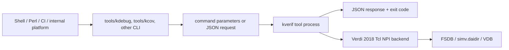
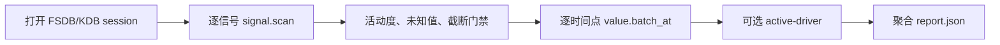

# kverif CLI 二次开发使用指导手册

本文面向需要用 Shell、Perl、Python、Ruby、Go、CI 流水线或内部平台调用
kverif 的验证工程师。二次开发不使用语言 SDK，也不导入 kverif 内部模块。
调用方只需要执行工具命令、传入参数，并解析 `--json` 输出。

典型用途包括：

- 基于 FSDB 编写波形活动度、异常窗口和协议检查脚本。
- 基于 VCS `-kdb` 生成的 `simv.daidir` 追踪模块端口和集成连线。
- 比较多轮 VDB，判断 coverage 增量、平台期和回归准入条件。
- 把 kverif 接入 Makefile、回归脚本、LSF、CI 或公司内部任务系统。
- 在不破坏 Verdi 2018 兼容性的前提下增加新的 kdebug/kcov action。

## 0. 表格式总览

本手册按“先查表、再复制命令、最后看完整工作流”的方式组织。表格中的命令均以 VM
普通用户 `host` 的固定安装目录 `/home/host/kverif` 为例；`/data/...` 是待替换的项目数据路径。
多行命令没有塞进表格单元格，避免复制时混入 `<br>` 或 Markdown 转义字符。

### 0.1 按任务选择工具

| 要解决的问题 | 首选命令 | 必需输入 | 典型输出 | 最小绝对路径命令 | 详细章节 |
| --- | --- | --- | --- | --- | --- |
| 查询单个时间点的信号值 | `kdebug value-at` | 原始 FSDB、完整信号名、时间 | 值、位宽、radix、查询时间 | `/home/host/kverif/tools/kdebug --json value-at --fsdb /data/run/waves.fsdb --signal tb_top.dut.ready --time 100ns --format hex` | 10.2 |
| 同一时间批量采样多个信号 | `kdebug value-batch` | FSDB、可重复 `--signal`、时间 | 每个信号的值和状态 | `/home/host/kverif/tools/kdebug --json value-batch --fsdb /data/run/waves.fsdb --signal tb_top.dut.valid --signal tb_top.dut.ready --time 100ns` | 10.2 |
| 扫描波形窗口、统计活动度或未知值 | `kdebug action signal.scan` | FSDB、信号、begin/end | 变化行、截断状态、活动度摘要 | `/home/host/kverif/tools/kdebug --json action signal.scan --fsdb /data/run/waves.fsdb --arg signal=tb_top.dut.valid --arg begin=0ns --arg end=1us --limit max_rows=500` | 9.1、10.2 |
| 查静态 driver、load 或依赖图 | `kdebug trace-driver/trace-graph` | 与当前构建匹配的 `simv.daidir`、完整层次信号名 | edge、源码位置、依赖图 | `/home/host/kverif/tools/kdebug --json trace-graph --daidir /data/build/simv.daidir --signal tb_top.dut.ready --max-depth 8 --include-source --include-trace` | 9.2、10.2 |
| 联合波形和连线定位当前生效 driver | `kdebug active-driver` | FSDB、daidir、信号、时间 | active edge、控制条件、trace | `/home/host/kverif/tools/kdebug --json active-driver --fsdb /data/run/waves.fsdb --daidir /data/build/simv.daidir --signal tb_top.dut.ready --time 1040ns --include-control --include-trace` | 10.2 |
| 调用 Verdi 2018 独立 Tcl NPI 能力 | `kdebug action` | action 对应的 daidir/CRDB/UPF/输出参数 | 网表、Text、DM、VCS、Power、CRDB 或 writer 结果 | `/home/host/kverif/tools/kdebug --json action netlist.resolve --daidir /data/build/simv.daidir --arg name=tb_top.dut.ready --arg object_type=npiNlNet` | 10.2.1 |
| 汇总、筛选或导出 VDB coverage | `kcov` | 真实 VDB 或命名 session | coverage summary、holes、artifact | `/home/host/kverif/tools/kcov --json cov-holes --vdb /data/run/simv.vdb --metrics line,toggle,branch --max-items 100` | 9.3、10.3 |
| 计算 SystemVerilog 位值、切片或条件 | `kbit` | literal/表达式、可选变量 | 确定位宽、值或布尔结论 | `/home/host/kverif/tools/kbit check --expr "valid && ready" --var "valid=1'b1" --var "ready=1'b1" --json` | 10.4 |
| 解码多拍 entry 字段 | `kentry` | YAML/JSON 配置、JSONL fragments | 拼接后的 entry 和字段切片 | `/home/host/kverif/tools/kentry decode --config /data/project/entry.yaml --input /data/run/fragments.jsonl --json --pretty` | 10.5 |
| 把日志位置短 ID 还原到源码 | `kloc` | `L_XXXXXXXX`、sidecar JSONL map | 文件、行号、上下文或热点 | `/home/host/kverif/tools/kloc context L_00000001 --map /data/run/sim.log.kloc.jsonl --before 8 --after 12 --json` | 10.6 |
| 列举、检查或解释 SVA | `ksva` | SVA 文件、可选 property | lint、说明或三层 IR | `/home/host/kverif/tools/ksva explain --file /data/project/assertions/protocol.sv --property p_req_grant --json --strict` | 10.7 |
| 维护项目验证知识和 debug brief | `kberif` | 当前项目根目录、kind/cards/details | topic、detail、brief、校验结果 | `cd /data/project/verification && /home/host/kverif/tools/kberif --json status` | 10.8 |
| 受控启动编译、仿真和回归 | `keda-runner` | `.keda-runner.yaml`、allowlist action | 最终 argv、被执行程序输出和退出码 | `/home/host/kverif/tools/keda-runner --config /data/project/.keda-runner.yaml run --action sim --target smoke --option TEST=basic --option SEED=123 --dry-run` | 10.9 |
| 高频、跨进程复用 debug/coverage session | `kverif-loop-server/client` | Unix socket、后端、数据库 | JSON-RPC response | `/home/host/kverif/tools/kverif-loop-client --socket /tmp/kverif-loop-host.sock ping` | 10.10 |
| Agent 接入或 LSF 部署自检 | `kverif-mcp`、`kverif-lsf-doctor` | 运行时环境变量 | MCP transport 或诊断结果 | `PYTHON=/home/host/kverif/.venv38/bin/python /home/host/kverif/tools/kverif-lsf-doctor` | 10.11 |

### 0.2 可执行文件绝对路径

| 工具变量 | VM 绝对路径 | 数据库/文件 | 主要用途 | 是否建议机器读取 JSON |
| --- | --- | --- | --- | --- |
| `KDEBUG` | `/home/host/kverif/tools/kdebug` | FSDB、`simv.daidir`、CRDB、RTL+UPF | 波形、连线、Tcl NPI、session | 是，使用 `--json` |
| `KCOV` | `/home/host/kverif/tools/kcov` | VDB | coverage 查询和导出 | 是，使用 `--json` |
| `KBIT` | `/home/host/kverif/tools/kbit` | literal、表达式、JSON values | 位运算和门禁条件 | 是，使用 `--json` |
| `KENTRY` | `/home/host/kverif/tools/kentry` | YAML/JSON、JSONL | 多拍 entry 解码 | 是，使用 `--json` |
| `KLOC` | `/home/host/kverif/tools/kloc` | 仿真日志、sidecar JSONL map | 位置还原、上下文、热点 | `resolve/context/stats` 建议 `--json` |
| `KSVA` | `/home/host/kverif/tools/ksva` | `.sv`/`.sva` | SVA 静态分析和 IR | `explain --json`；`parse` 固定输出 JSON |
| `KBERIF` | `/home/host/kverif/tools/kberif` | 项目文件、`.kberif` 状态 | 项目上下文 cards/details | 查询命令建议全局 `--json` |
| `KEDA_RUNNER` | `/home/host/kverif/tools/keda-runner` | `.keda-runner.yaml` | allowlist EDA 调度 | 否，消费退出码和命令输出 |
| `LOOP_SERVER` | `/home/host/kverif/tools/kverif-loop-server` | Unix socket | 长驻 session 服务 | 协议本身为 JSON |
| `LOOP_CLIENT` | `/home/host/kverif/tools/kverif-loop-client` | Unix socket | 参数式 JSON-RPC client | 是，stdout 为 JSON response |
| `KVERIF_MCP` | `/home/host/kverif/tools/kverif-mcp` | stdin/stdout transport | 可选 Agent 接入 | MCP 协议管理 |
| `LSF_DOCTOR` | `/home/host/kverif/tools/kverif-lsf-doctor` | 环境和 backend | direct/LSF 部署诊断 | 以退出码和诊断文本为准 |

### 0.3 调用方式对照

| 调用方式 | 适用场景 | 输入写法 | 完整例子 | 输出处理 | 关键限制 |
| --- | --- | --- | --- | --- | --- |
| 快捷参数 | 人工排查、单个常用查询 | 子命令加具名参数 | `/home/host/kverif/tools/kdebug --json value-at --fsdb /data/run/waves.fsdb --signal tb_top.dut.ready --time 100ns --format hex` | 保存 stdout JSON，另存 stderr | 每个参数必须是独立 argv；不要 `eval` |
| 通用 `action NAME` | 没有快捷子命令的 action | `--arg/--target/--limit/--output KEY=VALUE` | `/home/host/kverif/tools/kdebug --json action signal.scan --fsdb /data/run/waves.fsdb --arg signal=tb_top.dut.ready --arg begin=0ns --arg end=1us --limit max_rows=500` | 按 runtime schema 解析 `data` | `KEY=VALUE` 可重复；数组/对象必须作为一个 argv |
| JSON request 文件 | 参数复杂、需要审计或重放 | 唯一位置参数为 request 文件 | `/home/host/kverif/tools/kdebug --json /data/requests/signal-scan.request.json` | request/response 成对归档 | JSON 只表达参数；FSDB/KDB/VDB 仍是实际输入 |
| stdin JSON request | 流水线动态生成一次请求 | 位置参数 `-` | `printf '%s\n' '{"api_version":"kdebug.v1","action":"actions","args":{}}' \| /home/host/kverif/tools/kdebug --json -` | 按顶层 `ok` 判断 | stdout 不能混诊断文本 |
| 命名 session | 同一大数据库连续查询 | 先 open，再传 `--session`，最后 close | `/home/host/kverif/tools/kdebug --json value-batch --session wave_104 --signal tb_top.valid --signal tb_top.ready --time 100ns` | 每个 response 独立保存 | 用 trap/finally 保证 close；session ID 当前用户内唯一 |
| stdio loop | 单进程内大量 JSONL 请求 | `--stdio-loop`，一行一个 request | `/home/host/kverif/tools/kdebug --stdio-loop` | 首行等 `type=ready`，按 `request_id/id` 关联 | 协议 stdout 不可打印业务日志 |
| loop server/client | 多脚本共享长驻服务 | Unix socket 加 client 子命令 | `/home/host/kverif/tools/kverif-loop-client --socket /tmp/kverif-loop-host.sock --timeout-sec 0 debug-query --session wave0 --action value.at --arg signal=tb_top.clk --arg time=100ns --output-format json` | client stdout 为 JSON | server 生命周期和残留 session 由调用系统负责 |

### 0.4 公共参数写法

| 参数/形式 | 类型 | 必需性和默认值 | 可重复 | 示例值 | 完整 CLI 片段 | 校验或常见错误 |
| --- | --- | --- | --- | --- | --- | --- |
| `--json` | flag | 可选；默认 kout/人类文本 | 否 | 无值 | `--json value-at ...` | `kdebug/kcov` 可放子命令前；`kberif` 必须放子命令前；不要再用 `grep` 解析 JSON |
| `--fsdb FILE` | 文件路径 | 波形 action 必需；无默认值 | 否 | `/data/run/waves.fsdb` | `--fsdb /data/run/waves.fsdb` | 文件不存在、格式错误或缺 license 时 `ok=false`/非零退出 |
| `--daidir DIR` | 目录路径 | KDB action 必需；无默认值 | 否 | `/data/build/simv.daidir` | `--daidir /data/build/simv.daidir` | 必须与本次 VCS `-kdb` 构建匹配，不能跨构建复用 |
| `--vdb DIR` | 目录路径 | coverage action 必需，或改用 `--session` | 否 | `/data/run/simv.vdb` | `--vdb /data/run/simv.vdb` | `--fake` 仅合约测试，不能产生正式 coverage 结论 |
| `--session ID` | 字符串 | 可替代重复数据库参数；无默认值 | 否 | `wave_104` | `--session wave_104` | 不存在或已关闭时返回 session 错误 |
| `--signal NAME` | 完整层次名 | 依 action 必需 | `value-batch` 和工作流可重复 | `tb_top.dut.ready` | `--signal tb_top.dut.valid --signal tb_top.dut.ready` | 不要只传 RTL 叶子名；层次必须来自当前 FSDB/KDB |
| `--time/--at TIME` | 时间字符串 | value/active-driver 必需 | 否 | `1040ns` | `--time 1040ns` | 单位和范围由 action schema/backend 校验 |
| `--arg KEY=VALUE` | 自动类型化键值 | 通用 action 按 schema 决定 | 是 | `begin=0ns`、`overwrite=true` | `--arg signal=tb_top.valid --arg begin=0ns --arg end=1us` | 缺 `=` 返回 CLI 错误；`[`/`{` 开头会按 JSON 解析 |
| `--target KEY=VALUE` | 自动类型化键值 | 通用资源按 schema 决定 | 是 | `filelist=/data/power/run.f` | `--target filelist=/data/power/run.f --target upf=/data/power/design.upf` | 资源路径/组合必须满足 action request schema |
| `--limit KEY=VALUE` | 自动类型化键值 | 可选；默认由 action schema 决定 | 是 | `max_rows=500` | `--limit max_rows=500 --limit max_depth=8` | 使用正整数；结果截断仍需检查 response summary/warnings |
| `--output KEY=VALUE` | 自动类型化键值 | 可选；默认工具输出策略 | 是 | `verbosity=compact` | `--output verbosity=compact` | 不等同 shell 重定向；stdout 文件仍用 `>` 保存 |
| `--include/--exclude GLOB` | glob 字符串 | coverage 过滤可选 | 是 | `*fifo*` | `--include '*fifo*' --exclude '*assert*'` | 用引号阻止 shell 提前展开 glob |
| `--max-items N` | 正整数 | 可选；默认由 action 决定 | 否 | `100` | `--max-items 100` | 同时检查 `truncated`/overflow；不要假定返回全集 |
| `--timeout-ms N` | 正整数 | 可选；未传时使用 action/backend 默认值 | 否 | `120000` | `--timeout-ms 120000` | 只在调用方明确需要时设置；`0` 在部分 backend 表示“使用默认值”，不能统一理解为无限等待 |

可直接用于 Shell 的变量表：

```bash
KVERIF_HOME=/home/host/kverif
KDEBUG="$KVERIF_HOME/tools/kdebug"
KCOV="$KVERIF_HOME/tools/kcov"
KBIT="$KVERIF_HOME/tools/kbit"
KENTRY="$KVERIF_HOME/tools/kentry"
KLOC="$KVERIF_HOME/tools/kloc"
KSVA="$KVERIF_HOME/tools/ksva"
KBERIF="$KVERIF_HOME/tools/kberif"
KEDA_RUNNER="$KVERIF_HOME/tools/keda-runner"
LOOP_SERVER="$KVERIF_HOME/tools/kverif-loop-server"
LOOP_CLIENT="$KVERIF_HOME/tools/kverif-loop-client"
```

## 1. 二次开发契约

kverif 对外稳定接口由四部分组成：

| 接口 | 用途 | 示例 |
| --- | --- | --- |
| 可执行命令 | 语言无关的调用入口 | `/home/host/kverif/tools/kdebug` |
| 命令参数 | 常用查询和简单自动化 | `value-at --fsdb ... --signal ... --time ...` |
| JSON request/response | 复杂参数、可重放请求和结构化结果 | `kdebug --json request.json` |
| 退出码 | 流程控制和 CI 判定 | `0` 成功，非 `0` 失败 |

| 不应依赖的内部实现 | 原因 | 应使用的公开替代接口 |
| --- | --- | --- |
| kdebug、kcov 或 MCP 的 Python/C++ 内部模块 | 内部包路径和函数不是跨版本合同，也不利于 Shell/Perl 调用 | `/home/host/kverif/tools/*` 可执行命令 |
| Tcl backend 的私有 procedure | 私有 procedure 可随 action 实现调整 | `action NAME`、runtime `schema` 和 JSON response |
| Verdi NPI 动态库或头文件 | 会绑定 Verdi ABI、编译器和 license 环境 | kdebug 的 Verdi 2018 Tcl NPI action |
| 人类可读 `kout` 的列宽、缩进或措辞 | 文本显示可调整，不适合作为机器合同 | `--json` 后解析顶层 `ok`、`data`、`summary`、`warnings`、`error` |

只要命令、参数和 JSON action 契约保持兼容，调用脚本可以使用任何语言。

## 2. 架构与边界



职责边界：

| 层 | 负责 | 不负责 |
| --- | --- | --- |
| 项目脚本 | 项目规则、阈值、报告路径、重试和退出码 | NPI 数据访问 |
| kverif CLI | 参数校验、JSON 契约、session、过滤、导出 | 项目专有准入策略 |
| Tcl backend | 真实 FSDB/KDB/VDB 查询 | 项目流程编排 |
| MCP | AI Agent 工具适配 | 普通外部脚本的必要依赖 |

## 3. 相关目录

```text
kverif/
  tools/                              稳定命令入口
  examples/secondary_development/
    sh/                               Bash 直接调用示例
    csh/                              csh/tcsh 直接调用示例
    perl/                             Perl 直接调用示例
    py/                               Python subprocess 直接调用示例
    fixtures/fsdb_handshake/          RTL、testbench、真实 FSDB 和信号 manifest
    tests/                            无 EDA 的 CLI 合约测试
  kdebug/
    specs/actions/actions.yaml        action catalog
    schemas/v1/actions/               action-specific JSON schema
    examples/requests/                可重放 request
    examples/responses/               response 示例
    tcl_engine/                       Verdi Tcl NPI backend
  kcov/
    kcov/cli.py                       参数式和 JSON CLI
    tcl_engine/kcov_npi.tcl           coverage Tcl NPI backend
  doc/                                用户与二次开发文档
```

## 4. VM 环境准备

以下命令以普通用户 `host` 为例：

```bash
id -un
# 期望: host

export KVERIF_HOME=/home/host/kverif
export PATH="$KVERIF_HOME/tools:$PATH"

export VERDI_HOME=/home/synopsys/verdi/Verdi_O-2018.09-SP2
export VCS_HOME=/home/synopsys/vcs/O-2018.09-SP2
export VCS_TARGET_ARCH=linux64
export PATH="$VERDI_HOME/bin:$VCS_HOME/bin:$PATH"

# tools/kcov 需要 Python，但调用脚本不需要导入任何 kverif Python 包。
export PYTHON=/home/host/kverif/.venv38/bin/python
export KVERIF_JSON_PYTHON=/usr/bin/python3

# license 只由运行环境提供，不要写进脚本、日志或报告。
test -n "${LM_LICENSE_FILE:-}" || echo "LM_LICENSE_FILE is not set"
test -n "${SNPSLMD_LICENSE_FILE:-}" || echo "SNPSLMD_LICENSE_FILE is not set"
```

固定部署时推荐使用绝对路径：

```bash
KDEBUG=/home/host/kverif/tools/kdebug
KCOV=/home/host/kverif/tools/kcov
KBIT=/home/host/kverif/tools/kbit
```

### 4.1 跨设备部署边界

二次开发示例的控制层可复制到仓库外运行。复制时保留完整目录结构：

```text
secondary_development/
  sh/ csh/ perl/ py/
  fixtures/fsdb_handshake/
  json_response.py
```

不要只复制 `sh/regression_triage.sh`，因为它需要同目录的三个子流程；也不要只复制
Bash/csh/Perl 脚本而遗漏 `json_response.py`。这些脚本按自身文件位置找依赖，不按
当前工作目录找依赖，因此可以从项目目录、LSF scratch 目录或 CI workspace 启动。

控制脚本可移植不等于 EDA backend 可省略。真实执行矩阵如下：

| 查询 | 目标设备必须具备 |
| --- | --- |
| FSDB 波形 | 可执行 `kdebug`、兼容 Verdi、真实 FSDB、license |
| KDB 连线 | 可执行 `kdebug`、与本次构建匹配的 `simv.daidir`、兼容 Verdi/VCS、license |
| VDB coverage | 可执行 `kcov`、真实 VDB、兼容 coverage 环境、license |
| 假 CLI 合约 | Bash、Python 3、Perl；csh 用例在安装 csh/tcsh 时执行，不需要 EDA/license |

### 4.2 命令和 helper 发现顺序

所有示例采用一致的覆盖规则：

| 入口 | 从高到低的优先级 |
| --- | --- |
| `kdebug` | `--kdebug-bin`、`KDEBUG_BIN`、`$KVERIF_HOME/tools/kdebug`、仓库相对路径、`PATH` |
| `kcov` | `--kcov-bin`、`KCOV_BIN`、`$KVERIF_HOME/tools/kcov`、仓库相对路径、`PATH` |
| helper Python | `--json-python`、`KVERIF_JSON_PYTHON`、`PYTHON`、PATH 中的 `python3/python` |
| JSON helper | `--json-helper`、`KVERIF_JSON_HELPER`、脚本旁的 `../json_response.py`、`KVERIF_HOME` 下的副本 |

显式选项或对应环境变量一旦给出，就视为用户配置；路径不可执行时直接报错，不会静默
换成另一个工具。`KVERIF_HOME` 和仓库相对候选不存在时才继续查 `PATH`。

### 4.3 随库真实 FSDB fixture

为避免所有示例都依赖用户事先准备 `/data/run/waves.fsdb`，仓库提供：

```text
/home/host/kverif/examples/secondary_development/fixtures/fsdb_handshake/
  rtl/kverif_handshake_dut.sv
  tb/tb_kverif_handshake.sv
  waves.fsdb
  signal_manifest.json
  SHA256SUMS
  build_vcs.sh
```

FSDB 由上述 RTL/testbench 使用 VCS `O-2018.09-1_Full64` 和 Verdi
`Verdi_O-2018.09-SP2` 真实生成，不是空文件或 mock。文件大小为 9,107 字节，SHA-256
为 `f1c50e6e502f84450469932ceb7fe151057a06df02487840911b034134d38fb0`。该哈希只校验随库
预生成文件；重新生成的 FSDB 可能包含不同路径或时间元数据，应按 manifest 检查信号和值。

已验证的完整信号名：

| 信号 | 含义 |
| --- | --- |
| `tb_kverif_handshake.dut.req_valid` | 请求有效 |
| `tb_kverif_handshake.dut.req_ready` | 请求 ready |
| `tb_kverif_handshake.dut.req_fire` | `req_valid && req_ready` |
| `tb_kverif_handshake.dut.req_data` | 请求 payload |
| `tb_kverif_handshake.dut.rsp_valid` | 响应有效 |
| `tb_kverif_handshake.dut.rsp_data` | 变换后的响应数据 |
| `tb_kverif_handshake.dut.accepted_count` | 接收请求计数 |
| `tb_kverif_handshake.dut.state_q` | DUT 状态机 |
| `tb_kverif_handshake.dut.last_accepted_q` | 最近接收的数据 |

直接执行真实查询：

```bash
KVERIF_HOME=/home/host/kverif
FIXTURE=$KVERIF_HOME/examples/secondary_development/fixtures/fsdb_handshake

$KVERIF_HOME/tools/kdebug --json value-batch \
  --fsdb $FIXTURE/waves.fsdb \
  --signal tb_kverif_handshake.dut.req_fire \
  --signal tb_kverif_handshake.dut.rsp_data \
  --signal tb_kverif_handshake.dut.accepted_count \
  --time 95ns --format hex
```

实测应得到 `accepted_count=4`、`rsp_data=ec`。`signal_manifest.json` 还记录了全部 11 个
信号的位宽、变化次数和 45/55/75/95ns 检查点。需要 KDB 时，在目标设备运行
`bash $FIXTURE/build_vcs.sh`，使用生成的 `$FIXTURE/build/simv.daidir`；不要跨机器复用
预编译 daidir。

### 4.4 跨设备调用示例

PATH-only 搬迁示例：

```bash
cp -R /opt/kverif/examples/secondary_development \
  "/work/shared verification/kverif examples"
export PATH="/opt/kverif/tools:$PATH"

cd /work/project-a
bash "/work/shared verification/kverif examples/sh/module_connectivity.sh" \
  --daidir /data/build/simv.daidir \
  --signal tb_top.dut.req_valid --require-edge --require-complete \
  --out "/work/project-a/reports/connectivity result"
```

完全显式的 CI 调用：

```bash
bash "/work/shared verification/kverif examples/sh/regression_triage.sh" \
  --kdebug-bin /opt/kverif/tools/kdebug \
  --kcov-bin /opt/kverif/tools/kcov \
  --json-python /usr/bin/python3 \
  --json-helper "/work/shared verification/kverif examples/json_response.py" \
  --fsdb /data/run/waves.fsdb --daidir /data/run/simv.daidir \
  --vdb /data/run/simv.vdb --signal tb_top.dut.valid \
  --begin 0ns --end 1us --out /data/run/triage
```

## 5. 三种调用方式

### 5.1 参数式命令

适合常用操作，Shell 中最直观：

```bash
/home/host/kverif/tools/kdebug --json value-at \
  --fsdb /data/run/waves.fsdb \
  --signal tb.dut.ready \
  --time 100ns \
  --format hex \
  > /data/run/value-at.json

/home/host/kverif/tools/kcov --json cov-holes \
  --vdb /data/run/simv.vdb \
  --metrics line,toggle,branch \
  --max-items 50 \
  > /data/run/coverage-holes.json
```

参数必须作为独立 argv 传递。不要使用 `eval`，也不要把数据库路径和信号名拼成
一条未经引用的字符串。

### 5.2 原始 JSON request

复杂 action 使用 JSON 文件或 stdin。JSON 是工具参数的结构化表达，不是额外的
波形输入文件；FSDB、daidir 和 VDB 仍然是实际 EDA 数据库。

```json
{
  "api_version": "kdebug.v1",
  "request_id": "project-query-001",
  "action": "signal.scan",
  "target": {"fsdb": "/data/run/waves.fsdb"},
  "args": {
    "signal": "tb.dut.ready",
    "begin": "0ns",
    "end": "1us",
    "format": "hex"
  },
  "limits": {"max_rows": 200},
  "output": {"format": "json", "verbosity": "compact"}
}
```

```bash
/home/host/kverif/tools/kdebug --json /data/run/signal-scan.request.json \
  > /data/run/signal-scan.response.json

printf '%s\n' '{"api_version":"kdebug.v1","action":"actions","args":{}}' \
  | /home/host/kverif/tools/kdebug --json - \
  > /data/run/actions.json
```

使用 runtime schema 确认参数，不要根据字段名猜测：

```bash
kdebug --json actions > /tmp/kdebug-actions.json
kdebug --json schema --action signal.scan --kind request \
  > /tmp/signal-scan-schema.json
kcov --json schema --action cov.holes --kind request \
  > /tmp/cov-holes-schema.json
```

### 5.3 命名 session

多个命令复用同一个大数据库时，先打开 session，再传 `--session` 查询，最后关闭。
session 由工具维护，因此调用方仍然只是执行普通命令。

```bash
KDEBUG=/home/host/kverif/tools/kdebug
SESSION="project_wave_$$"

cleanup() {
  "$KDEBUG" --json session-close --session "$SESSION" \
    > /tmp/kdebug-close.json 2>/tmp/kdebug-close.stderr || true
}
trap cleanup EXIT INT TERM

"$KDEBUG" --json session-open \
  --name "$SESSION" \
  --fsdb /data/run/waves.fsdb \
  > /tmp/kdebug-open.json

"$KDEBUG" --json value-batch \
  --session "$SESSION" \
  --signal tb.dut.valid \
  --signal tb.dut.ready \
  --time 100ns \
  --format hex \
  > /tmp/kdebug-values.json
```

长期服务或高频请求也可直接驱动 `--stdio-loop` JSONL 进程。其 stdout 每行都是
协议消息，首行是 `type:"ready"`，随后请求与响应按 `request_id`/`id` 关联。
Bash/csh/Perl/Python 若不需要长期单进程，优先使用命名 session，生命周期更容易处理。

## 6. 输出与错误处理

### 6.1 不要只看退出码

调用脚本应同时检查：

1. 进程退出码是否为 `0`。
2. stdout 是否为合法 JSON object。
3. JSON 顶层 `.ok` 是否为 `true`。
4. `.warnings`、`.summary.truncated` 或 action-specific 截断字段。

Bash：

```bash
output=/data/run/result.json
stderr_file=/data/run/result.stderr

if ! /home/host/kverif/tools/kdebug --json value-at \
    --fsdb /data/run/waves.fsdb \
    --signal tb.dut.ready --time 100ns \
    >"$output" 2>"$stderr_file"; then
  echo "tool process failed; see $stderr_file" >&2
  exit 1
fi

python3 /home/host/kverif/examples/secondary_development/json_response.py \
  check-ok "$output" || {
  echo "tool returned ok=false; see $output" >&2
  exit 1
}
```

不要用 `grep '"ok": true'` 解析 JSON。字段顺序、空白和 pretty-print 设置都可能变化。

### 6.2 推荐项目退出码

| 退出码 | 建议含义 |
| --- | --- |
| `0` | 查询成功且项目规则通过 |
| `1` | 工具执行或 JSON response 失败 |
| `2` | 调用脚本参数、路径或依赖错误 |
| `3` | 工具查询成功，但 coverage/checker 准入未通过 |
| `130` | 用户中断 |

### 6.3 stdout/stderr

- `--json` 的 stdout 只用于机器结果。
- 日志和诊断写 stderr 或独立日志文件。
- 先写临时文件，再原子移动为最终报告，避免下游读到半个 JSON。
- 大结果使用 `limits`、`--max-items` 或工具导出能力，不要无限扩大 stdout。

## 7. Bash 调用模式

使用 Bash array 保留参数边界：

```bash
cmd=(/home/host/kverif/tools/kdebug --json value-batch --fsdb /data/run/waves.fsdb)
for signal in tb.dut.valid tb.dut.ready tb.dut.data; do
  cmd+=(--signal "$signal")
done
cmd+=(--time 100ns --format hex)
"${cmd[@]}" > /data/run/value-batch.json
```

仓库提供五个完整 Bash 示例：

```text
examples/secondary_development/sh/waveform_window.sh
examples/secondary_development/sh/module_connectivity.sh
examples/secondary_development/sh/coverage_convergence.sh
examples/secondary_development/sh/regression_triage.sh
examples/secondary_development/sh/signal_health.sh
```

它们只使用命令、参数、JSON 和退出码，不导入项目代码。仓库附带的
`json_response.py` 仅以独立进程调用 Python 标准库校验结果，不是可导入 SDK，
也不要求 VM 安装 `jq` 或 CPAN 模块。

## 8. 跨语言调用和结论生成

### 8.1 Perl list-form 调用

Perl 使用 list form 启动命令，避免经过 shell 二次解释：

```perl
my @cmd = (
    '/home/host/kverif/tools/kdebug', '--json', 'value-at',
    '--fsdb', '/home/host/kverif/examples/secondary_development/fixtures/fsdb_handshake/waves.fsdb',
    '--signal', 'tb_kverif_handshake.dut.rsp_data',
    '--time', '95ns',
);

open my $pipe, '-|', @cmd or die "cannot start kdebug: $!\n";
local $/;
my $text = <$pipe>;
close $pipe;
my $rc = $? >> 8;
die "kdebug failed rc=$rc\n" if $rc != 0;

my $output = '/data/run/value-at.json';
open my $fh, '>', $output or die "cannot write $output: $!\n";
print {$fh} $text;
close $fh;

```

完整的 session、清理和多信号示例：

```bash
perl /home/host/kverif/examples/secondary_development/perl/waveform_window.pl \
  --fsdb /home/host/kverif/examples/secondary_development/fixtures/fsdb_handshake/waves.fsdb \
  --signal tb_kverif_handshake.dut.req_valid \
  --signal tb_kverif_handshake.dut.rsp_data \
  --begin 0ns --end 125ns \
  --time 45ns --time 95ns \
  --out /data/run/wave-perl
```

该示例只使用 Perl 核心模块，不需要安装 CPAN 包。需要读取业务字段时，
`signal_health.pl` 会启动仓库内独立的标准库 JSON helper，读取三个 summary 字段，
随后由 Perl 自身比较阈值并生成结论：

```bash
KDEBUG_BIN=/home/host/kverif/tools/kdebug \
KVERIF_JSON_PYTHON=/usr/bin/python3 \
perl /home/host/kverif/examples/secondary_development/perl/signal_health.pl \
  --fsdb /home/host/kverif/examples/secondary_development/fixtures/fsdb_handshake/waves.fsdb \
  --signal tb_kverif_handshake.dut.accepted_count \
  --begin 0ns --end 125ns --min-changes 5 --max-unknown 0 --require-complete \
  --out /data/run/conclusions/perl
```

### 8.2 csh/tcsh 调用

csh 没有可靠的内建 JSON parser，因此脚本不要使用 `grep` 猜字段。示例把完整
response 保存到文件，通过独立 helper 读取 `change_count`、`unknown_count` 和
`truncated`，再由 csh 的 `if/else` 规则得出项目结论：

```csh
setenv KDEBUG_BIN /home/host/kverif/tools/kdebug
setenv KVERIF_JSON_PYTHON /usr/bin/python3

csh /home/host/kverif/examples/secondary_development/csh/signal_health.csh \
  --fsdb /home/host/kverif/examples/secondary_development/fixtures/fsdb_handshake/waves.fsdb \
  --signal tb_kverif_handshake.dut.accepted_count \
  --begin 0ns --end 125ns --min-changes 5 --max-unknown 0 --require-complete \
  --out /data/run/conclusions/csh
```

### 8.3 Python subprocess 调用

Python 示例只使用标准库。`subprocess.run()` 启动 `tools/kdebug`，`json.load()`
读取 response，然后脚本自己的 `classify()` 函数产生结论；它没有导入任何 kverif
内部模块：

```bash
KDEBUG_BIN=/home/host/kverif/tools/kdebug \
/usr/bin/python3 /home/host/kverif/examples/secondary_development/py/signal_health.py \
  --fsdb /home/host/kverif/examples/secondary_development/fixtures/fsdb_handshake/waves.fsdb \
  --signal tb_kverif_handshake.dut.accepted_count \
  --begin 0ns --end 125ns --min-changes 5 --max-unknown 0 --require-complete \
  --out /data/run/conclusions/python
```

### 8.4 四语言统一结论合同

Bash、csh、Perl 和 Python 的 `signal_health` 示例共享同一参数和报告合同：

| 参数 | 默认值 | 作用 |
| --- | --- | --- |
| `--fsdb FILE` | 无 | kdebug 的真实 FSDB 输入 |
| `--signal NAME` | 无 | 需要评价的完整信号层次名 |
| `--begin/--start TIME` | 无 | `signal.scan` 起点 |
| `--end/--stop TIME` | 无 | `signal.scan` 终点 |
| `--max-rows N` | `200` | 工具最大返回行数 |
| `--min-changes N` | `1` | 最少变化次数 |
| `--max-unknown N` | `0` | 最大 X/Z 次数 |
| `--require-complete` | 关闭 | 开启后禁止截断 response |
| `--kdebug-bin CMD` | 自动发现 | 显式指定 kdebug，可用路径或 PATH 中的命令名 |
| `--json-python CMD` | 自动发现 | Bash/csh/Perl：显式指定运行 JSON helper 的 Python 3 |
| `--json-helper FILE` | 脚本相对路径 | Bash/csh/Perl：显式指定独立 JSON helper 文件；Python 示例不接受这两个选项 |
| `--out DIR` | 无 | 原始 response 和派生报告目录 |

处理优先级是 `INCOMPLETE`、`UNKNOWN_VALUES`、`INACTIVE`、`HEALTHY`。每个脚本
保存原始 `tool-response.json`，并生成 `kverif.example.signal-health.v1`
`conclusion.json`。成功结论返回 `0`，工具/JSON 失败返回 `1`，参数错误返回 `2`，
查询成功但派生门禁不通过返回 `3`。

## 9. 四类可复用二次开发工作流

本章示例不是只有一条查询命令的 smoke，而是可以直接拆入项目回归的完整流程。它们都包含：

1. 参数校验和安全的 argv 传递。
2. 原始工具 response 归档。
3. JSON 结构校验和跨查询聚合。
4. 项目门禁、明确退出码和中断清理。
5. 不导入任何 kverif 语言包，只启动 `tools/` 下的命令。

### 9.1 多信号波形窗口与 active-driver 联合分析

脚本：`examples/secondary_development/sh/waveform_window.sh`

处理流程：



| 参数 | 必需 | 含义 |
| --- | --- | --- |
| `--fsdb FILE` | 是 | 原始 FSDB 波形文件，不是 JSON 文件 |
| `--signal NAME` | 是，可重复 | 需要扫描和批量采样的完整信号层次名 |
| `--begin/--start TIME` | 是 | 扫描窗口起点，例如 `0ns` |
| `--end/--stop TIME` | 是 | 扫描窗口终点，例如 `1us` |
| `--time TIME` | 否，可重复 | 在指定时间点执行一次多信号 `value.batch_at` |
| `--daidir DIR` | 条件必需 | active-driver 所需的 VCS `-kdb` elaboration 库 |
| `--active-signal NAME` | 条件必需 | 需要做动态因果分析的信号 |
| `--active-time TIME` | 条件必需 | active-driver 采样时间；必须与 `--active-signal`、`--daidir` 同时使用 |
| `--max-rows N` | 否 | 每个 `signal.scan` 最大返回行数，默认 `200` |
| `--min-changes N` | 否 | 每个信号最少变化次数，低于该值时门禁失败，默认 `0` |
| `--max-unknown N` | 否 | 每个信号允许的最大 X/Z 次数；不传则不检查 |
| `--require-complete` | 否 | 发现 scan 截断时门禁失败 |
| `--kdebug-bin CMD` | 否 | 覆盖 kdebug 自动发现结果 |
| `--json-python CMD`、`--json-helper FILE` | 否 | 覆盖 JSON helper 运行入口和文件 |
| `--out DIR` | 是 | 原始 response、日志和聚合报告目录 |

复杂调用示例：

```bash
export KDEBUG_BIN=/home/host/kverif/tools/kdebug
export KVERIF_JSON_PYTHON=/usr/bin/python3

bash /home/host/kverif/examples/secondary_development/sh/waveform_window.sh \
  --fsdb /data/regress/case_104/waves.fsdb \
  --daidir /data/regress/case_104/simv.daidir \
  --signal tb_top.dut.req_valid \
  --signal tb_top.dut.req_ready \
  --signal tb_top.dut.req_payload \
  --begin 900ns --end 1300ns \
  --time 980ns --time 1040ns --time 1120ns \
  --active-signal tb_top.dut.req_ready --active-time 1040ns \
  --max-rows 2000 --min-changes 1 --max-unknown 0 --require-complete \
  --out /data/regress/case_104/kverif/waveform
```

| 产物 | 内容 |
| --- | --- |
| `session.open.json`、`session.close.json` | session 生命周期证据 |
| `scan.<signal>.json` | 每个信号完整 `signal.scan` response |
| `sample.<time>.json` | 每个采样点的多信号值 |
| `active-driver.json` | 可选的动态 driver、控制条件和 trace |
| `signals.ndjson` | 每行一个信号的活动度摘要，便于流式处理 |
| `gate-errors.txt` | 所有门禁失败原因，不只保留第一个错误 |
| `report.json` | `kverif.cli.waveform-window.v2` 聚合报告 |

工具执行或 JSON 校验失败时退出 `1`；参数错误退出 `2`；查询成功但项目门禁失败退出 `3`。

### 9.2 模块 driver/load/graph 集成连线审计

脚本：`examples/secondary_development/sh/module_connectivity.sh`

该流程对每个信号同时查询静态 driver、可选 load 和依赖图。它用于检查新模块接入、端口重命名、wrapper 连线遗漏，以及综合网表前的 RTL 集成关系。

| 参数 | 必需 | 含义 |
| --- | --- | --- |
| `--daidir DIR` | 是 | VCS 使用 `-kdb` 构建后生成的 `simv.daidir` |
| `--signal NAME` | 是，可重复 | elaboration 后的完整信号层次名 |
| `--max-depth N` | 否 | 依赖图最大追踪深度，默认 `6` |
| `--max-items N` | 否 | driver/load/graph 最大返回项数，默认 `200` |
| `--no-loads` | 否 | 跳过 fanout/load 查询，缩短只查 driver 的任务 |
| `--require-edge` | 否 | 任一信号没有 driver edge 时门禁失败 |
| `--require-complete` | 否 | 任一依赖图被截断时门禁失败 |
| `--kdebug-bin CMD` | 否 | 覆盖 kdebug 自动发现结果 |
| `--json-python CMD`、`--json-helper FILE` | 否 | 覆盖 JSON helper 运行入口和文件 |
| `--out DIR` | 是 | 查询 response 和聚合报告目录 |

复杂调用示例：

```bash
export KDEBUG_BIN=/home/host/kverif/tools/kdebug
export KVERIF_JSON_PYTHON=/usr/bin/python3

bash /home/host/kverif/examples/secondary_development/sh/module_connectivity.sh \
  --daidir /data/build/simv.daidir \
  --signal tb_top.soc.core0.lsu.req_valid \
  --signal tb_top.soc.core0.lsu.req_ready \
  --signal tb_top.soc.core0.lsu.req_bits_addr \
  --max-depth 10 --max-items 1000 \
  --require-edge --require-complete \
  --out /data/build/reports/lsu-connectivity
```

每个信号生成 `driver.*.json`、`load.*.json` 和 `graph.*.json`。`signals.ndjson` 保存每个信号的 driver/load/graph 摘要，`report.json` 使用
`kverif.cli.module-connectivity.v2` schema，`gate-errors.txt` 保存集成门禁失败原因。

此场景必须使用 KDB/daidir。FSDB 只保存随时间变化的波形值，不包含完整静态 elaboration 连接关系。信号应使用 elaboration 后的实例路径，而不是 RTL module type 名称。

### 9.3 多轮 VDB 覆盖率收敛与防回退门禁

脚本：`examples/secondary_development/sh/coverage_convergence.sh`

脚本按 `--run` 顺序比较多轮 VDB，计算 covered/coverable 加权覆盖率、相邻轮增量、平台期和最终 hole 数量。它不仅判断“是否超过 95%”，还可以阻止覆盖率回退或长期无增长。

| 参数 | 必需 | 含义 |
| --- | --- | --- |
| `--run LABEL=VDB` | 是，可重复 | 一轮 coverage 结果；顺序就是趋势时间顺序，label 应唯一 |
| `--metrics LIST` | 否 | 逗号分隔 metric，默认 `line,toggle,branch` |
| `--hole-limit N` | 否 | 每轮归档的 hole 最大数量，默认 `50` |
| `--plateau-epsilon PCT` | 否 | 相邻轮绝对增量不大于该百分点时标记 plateau，默认 `0.01` |
| `--fail-under PCT` | 否 | 最终加权覆盖率最低阈值 |
| `--max-final-holes N` | 否 | 最后一轮最大允许 hole 数 |
| `--max-regression PCT` | 否 | 任一相邻轮允许的最大负向回退百分点 |
| `--require-growth` | 否 | 有多轮数据时，要求至少一轮产生正增量 |
| `--fake` | 否 | 使用 kcov 内置数据做无 EDA 合约测试 |
| `--kcov-bin CMD` | 否 | 覆盖 kcov 自动发现结果 |
| `--json-python CMD`、`--json-helper FILE` | 否 | 覆盖 JSON helper 运行入口和文件 |
| `--out DIR` | 是 | 每轮 response、NDJSON 和收敛报告目录 |

复杂调用示例：

```bash
export KCOV_BIN=/home/host/kverif/tools/kcov
export PYTHON=/home/host/kverif/.venv38/bin/python
export KVERIF_JSON_PYTHON=/usr/bin/python3

bash /home/host/kverif/examples/secondary_development/sh/coverage_convergence.sh \
  --run smoke=/regress/20260714/smoke/simv.vdb \
  --run nightly=/regress/20260715/nightly/simv.vdb \
  --run closure=/regress/20260716/closure/simv.vdb \
  --metrics line,toggle,branch,condition \
  --hole-limit 500 --plateau-epsilon 0.05 \
  --fail-under 95 --max-final-holes 100 \
  --max-regression 0.10 --require-growth \
  --out /regress/reports/coverage-convergence
```

| 产物 | 内容 |
| --- | --- |
| `<label>.summary.json` | 每轮 `cov-summary` 原始 response |
| `<label>.holes.json` | 每轮 `cov-holes` 原始 response |
| `runs.ndjson` | 每轮一行，含覆盖率、delta、plateau、hole 数及原始文件路径 |
| `convergence.json` | `kverif.cli.coverage-convergence.v1` 趋势和全部 gate 配置 |

任一 coverage gate 失败时退出 `3`。无 EDA smoke 可运行：

```bash
bash /home/host/kverif/examples/secondary_development/sh/coverage_convergence.sh \
  --run base=fake --run next=fake --fake \
  --fail-under 0 --max-final-holes 1000 \
  --out /tmp/kverif-coverage-fake
```

### 9.4 FSDB、KDB、VDB 跨工具回归分诊

脚本：`examples/secondary_development/sh/regression_triage.sh`

这个入口把前三类分析组合成一次回归分诊。波形活动度通过后，继续验证静态连线，再检查当前 VDB 准入，最终形成一个可供 CI、邮件机器人或问题单系统消费的统一 JSON。

| 参数 | 必需 | 含义 |
| --- | --- | --- |
| `--fsdb FILE` | 是 | 失败用例 FSDB |
| `--daidir DIR` | 是 | 与该构建对应的 KDB/daidir |
| `--vdb DIR` | 是 | 当前回归 VDB |
| `--signal NAME` | 是，可重复 | 同时参加波形和静态连线检查的信号 |
| `--begin/--start TIME`、`--end/--stop TIME` | 是 | 波形分析窗口 |
| `--time TIME` | 否，可重复 | 需要归档的多信号采样点 |
| `--metrics LIST` | 否 | coverage metric，默认 `line,toggle,branch` |
| `--fail-under PCT` | 否 | 最终 coverage 最低阈值 |
| `--max-final-holes N` | 否 | 最大最终 hole 数 |
| `--min-changes N` | 否 | 波形最少变化次数，默认 `1` |
| `--active-signal NAME`、`--active-time TIME` | 否，成对使用 | 增加 active-driver 动态因果证据 |
| `--kdebug-bin CMD`、`--kcov-bin CMD` | 否 | 覆盖两个工具的自动发现结果，并传给子流程 |
| `--json-python CMD`、`--json-helper FILE` | 否 | 覆盖 helper 配置，并传给子流程 |
| `--out DIR` | 是 | 三个子报告和统一报告目录 |

```bash
export KDEBUG_BIN=/home/host/kverif/tools/kdebug
export KCOV_BIN=/home/host/kverif/tools/kcov
export PYTHON=/home/host/kverif/.venv38/bin/python
export KVERIF_JSON_PYTHON=/usr/bin/python3

bash /home/host/kverif/examples/secondary_development/sh/regression_triage.sh \
  --fsdb /regress/fail_104/waves.fsdb \
  --daidir /regress/fail_104/simv.daidir \
  --vdb /regress/fail_104/simv.vdb \
  --signal tb_top.dut.req_valid \
  --signal tb_top.dut.req_ready \
  --begin 900ns --end 1300ns \
  --time 980ns --time 1040ns --time 1120ns \
  --active-signal tb_top.dut.req_ready --active-time 1040ns \
  --min-changes 1 --metrics line,toggle,branch \
  --fail-under 95 --max-final-holes 100 \
  --out /regress/fail_104/kverif-triage
```

最终目录包含：

```text
kverif-triage/
  waveform/       FSDB scan、采样、active-driver 和波形 gate
  connectivity/   driver/load/graph 和连线 gate
  coverage/       当前 VDB summary、holes 和 coverage gate
  report.json     kverif.cli.regression-triage.v1 统一索引
```

项目二次开发时，可以在统一报告之后继续调用缺陷分类、HTML 渲染、数据库写入或通知命令。应保留前三个子报告作为可追溯证据，不要只保存最终一个布尔值。

## 10. 独立 CLI 参数与功能参考

本章集中列出二次开发会直接调用的公开命令。示例统一把工具变量设置为绝对路径；`"$KDEBUG"` 等写法在 Shell 展开后仍然是绝对路径调用，不依赖当前目录或交互式 `PATH`。

### 10.1 查阅约定

```bash
KVERIF_HOME=/home/host/kverif
KDEBUG="$KVERIF_HOME/tools/kdebug"
KCOV="$KVERIF_HOME/tools/kcov"
KBIT="$KVERIF_HOME/tools/kbit"
KENTRY="$KVERIF_HOME/tools/kentry"
KLOC="$KVERIF_HOME/tools/kloc"
KBERIF="$KVERIF_HOME/tools/kberif"
KSVA="$KVERIF_HOME/tools/ksva"
KEDA_RUNNER="$KVERIF_HOME/tools/keda-runner"
```

| 记号 | 含义 |
| --- | --- |
| `<value>` | 必需位置参数或参数值，调用时不保留尖括号 |
| `[option]` | 可选参数 |
| `可重复` | 参数可以出现多次，每次必须是独立 argv |
| `key=value` | 通用结构化参数；不要用 `eval` 拼接 |
| `--json` | 查询内容不变，只把 stdout 切换为机器可解析 JSON |
| stdout | `--json` 时只保存 response；不要把诊断日志混入该文件 |
| stderr | 诊断、后端日志或调用失败原因 |

`kdebug` 和 `kcov` 的通用 `key=value` 会识别字符串、整数、浮点数、`true`、`false`、`null`；值以 `[` 或 `{` 开头时会尝试解析为 JSON 数组或对象。包含空格、glob、方括号或 SystemVerilog 字面量时，应整体加引号。

### 10.2 kdebug：FSDB 波形和 KDB 静态因果查询

**功能和输入**

| 输入 | 用途 |
| --- | --- |
| `--fsdb FILE` | scope、值、事件、统计、协议和窗口类波形查询 |
| `--daidir DIR` | driver、load、source、graph、FSM 等静态设计查询 |
| `--fsdb + --daidir` | 某个时间点的 active-driver 联合分析 |
| `--session ID` | 复用已经加载的数据库，适合一个脚本内的多次查询 |

默认 stdout 为 kout。增加 `--json` 后，response 顶层通常包含 `ok`、`action`、`request_id`、`summary`、`data`、`warnings`；失败时包含 `error.code`、`error.message` 和可选 detail。工具成功且 `ok=true` 返回 `0`，请求或后端失败返回非零。

**全部快捷参数**

| 参数 | 类型、必需性与默认值 | 可重复 | 写入 request | 示例值 | 完整 CLI 片段 | 校验和注意事项 |
| --- | --- | --- | --- | --- | --- | --- |
| `--json` | flag；可选；默认 kout | 否 | `output.format=json` | 无值 | `--json value-at ...` | 可放在快捷子命令前或后；stdout 只用于 response |
| `--text/--kout` | flag；可选 | 否 | 输出选择 | 无值 | `--kout actions` | 强制人类文本；机器脚本不要解析 kout |
| `--session/--session-id ID` | 字符串；使用已打开 session 时必需 | 否 | `target.session_id`、兼容 `args.session_id` | `debug_104` | `--session debug_104` | session 不存在、类型不匹配或已关闭时失败 |
| `--name ID` | 字符串；`session-open` 建议显式给出 | 否 | `args.name` | `debug_104` | `session-open --name debug_104 ...` | 当前用户 session 名应唯一，避免并发脚本互相关闭 |
| `--fsdb FILE` | 文件路径；波形 action 必需，或改用 session | 否 | `target.fsdb` | `/data/run/waves.fsdb` | `--fsdb /data/run/waves.fsdb` | 必须是真实 FSDB，不是 JSON manifest |
| `--daidir DIR` | 目录路径；设计 action 必需，或改用 session | 否 | `target.daidir` | `/data/build/simv.daidir` | `--daidir /data/build/simv.daidir` | 必须来自匹配本次 RTL/VCS 构建的 `-kdb` elaboration |
| `--signal NAME` | 字符串；value/trace 类 action 必需 | 仅 `value-batch` 累加；其他 action 后值覆盖前值 | `args.signal` 或 `args.signals[]` | `tb_top.dut.ready` | `--signal tb_top.dut.valid --signal tb_top.dut.ready` | 使用 FSDB/KDB 中的完整层次名；批量查询也可用 `--signals` |
| `--signals A,B,C` | 逗号分隔字符串；`value-batch` 可用 | 否 | `args.signals` | `tb_top.valid,tb_top.ready` | `--signals tb_top.valid,tb_top.ready` | 信号名若本身包含逗号，应改用重复 `--signal` |
| `--time/--at TIME` | 时间字符串；value/active-driver 类必需 | 否 | `args.time`；active-driver 写 `args.requested_time` | `1040ns` | `--time 1040ns` | 时间格式和范围由 action/backend 校验 |
| `--requested-time TIME` | 时间字符串；active-driver 可显式使用 | 否 | `args.requested_time` | `1040ns` | `--requested-time 1040ns` | 与 `--time` 二选一即可，后出现的值生效 |
| `--format/--radix NAME` | 字符串；可选；action 默认通常为 `bin` | 否 | `args.format`、`args.radix` | `hex` | `--format hex` | 常用 `bin/hex/dec`；实际枚举以 action schema 为准 |
| `--path PATH` | 字符串；按 action 可选/必需 | 否 | `args.path` | `tb_top.dut` | `--path tb_top.dut` | 表示设计/波形层次，不是操作系统路径时不要误加 `/` |
| `--scope PATH` | 字符串；coverage-like 范围参数 | 否 | `args.scope`；`scope-list` 同时写 `args.path` | `tb_top.dut` | `--scope tb_top.dut` | action 不支持 scope 时 schema 会拒绝 |
| `--kind request/response` | 枚举；`schema` 可选；默认 request | 否 | `args.kind` | `response` | `schema --action signal.scan --kind response` | 只用于 schema 查询 |
| `--action NAME` | action 名；`schema` 必需 | 否 | `args.action` | `signal.scan` | `schema --action signal.scan --kind request` | 不存在时返回 `ACTION_NOT_FOUND` 或 schema 错误 |
| `--transport uds/tcp/file` | 枚举；session-open 可选；同机优先 `uds` | 否 | `args.transport` | `uds` | `--transport uds` | transport 的可用性取决于部署；file 模式通常只用于兼容环境 |
| `--host HOST` | 字符串；TCP session 可选 | 否 | `args.host` | `127.0.0.1` | `--host 127.0.0.1` | 客户端必须可达该地址 |
| `--bind-host HOST` | 字符串；TCP session 可选 | 否 | `args.bind_host` | `127.0.0.1` | `--bind-host 127.0.0.1` | 不要在无访问控制时监听公网地址 |
| `--port N` | 整数；TCP session 可选；`0` 可自动分配 | 否 | `args.port` | `0` | `--port 0` | 非整数按 CLI 标量规则解析后由 schema/backend 拒绝 |
| `--include-source` | flag；可选；默认 false | 否 | `args.include_source=true` | 无值 | `trace-driver ... --include-source` | 增加源码证据，也可能增大 response |
| `--include-trace` | flag；可选；默认 false | 否 | `args.include_trace=true` | 无值 | `active-driver ... --include-trace` | 用于保存因果追踪过程 |
| `--include-control` | flag；可选；默认 false | 否 | `args.include_control=true` | 无值 | `active-driver ... --include-control` | 主要用于 active-driver 控制条件 |
| `--include-raw` | flag；可选；默认 false | 否 | `args.include_raw=true` | 无值 | `value-at ... --include-raw` | 原始字段可能较大；业务脚本优先消费稳定字段 |
| `--verbosity compact/full/debug` | 枚举；可选；默认 `compact` | 否 | `output.verbosity` | `full` | `--verbosity full` | `debug` 可能包含更多进程细节，不应默认长期归档 |
| `--max-rows N` | 整数；可选；action 各有默认值 | 否 | `limits.max_rows` | `500` | `--max-rows 500` | 返回后检查 `truncated`，不能把 500 行当全集 |
| `--max-results/--max-items N` | 整数；可选；action 各有默认值 | 否 | 同时写 `limits.max_results/max_items` | `200` | `--max-items 200` | 兼容不同 action 的结果上限字段 |
| `--max-depth N` | 整数；可选；action 各有默认值 | 否 | `limits.max_depth`、`args.max_depth` | `8` | `--max-depth 8` | 图在深度上限停止时检查截断/告警字段 |
| `--timeout-ms N` | 正整数；可选；未传时使用 backend 默认值 | 否 | `limits.timeout_ms` | `120000` | `--timeout-ms 120000` | `0` 在部分路径表示采用默认期限，并非统一的无限等待 |
| `--arg KEY=VALUE` | 自动类型化键值；由 action schema 决定 | 是 | dotted key 写入 `args` | `query.mode=tail` | `--arg signal=tb_top.clk --arg begin=0ns --arg end=1us` | 缺 `=` 为 CLI 错误；数组/对象整体加引号 |
| `--target KEY=VALUE` | 自动类型化键值；由 action schema 决定 | 是 | dotted key 写入 `target` | `upf=/data/power/design.upf` | `--target filelist=/data/power/run.f --target upf=/data/power/design.upf` | 用于没有专用快捷参数的资源字段 |
| `--limit KEY=VALUE` | 自动类型化键值；可选 | 是 | dotted key 写入 `limits` | `max_rows=500` | `--limit max_rows=500 --limit max_depth=8` | 与快捷 limit 同时出现时，按 argv 处理后的最终字段值生效 |
| `--output KEY=VALUE` | 自动类型化键值；可选 | 是 | dotted key 写入 `output` | `verbosity=compact` | `--output verbosity=compact` | 不代替 shell `>` 重定向 |

**子命令、功能和专用参数**

| 子命令 | 用途 | 必需参数 | 常用可选参数/默认值 | 可直接运行的绝对路径例子 | 主要结果或错误 |
| --- | --- | --- | --- | --- | --- |
| `actions` | 列出运行时 action catalog | 无 | `--json`；默认 kout | `/home/host/kverif/tools/kdebug --json actions` | `data` 含 action/status/version；部署自检应归档 |
| `schema` | 返回 action request/response schema | `--action NAME` | `--kind request/response`，默认 request；`--json` | `/home/host/kverif/tools/kdebug --json schema --action signal.scan --kind request` | action 不存在时返回 schema/action 错误 |
| `session-open` | 加载 FSDB、KDB 或联合数据库 | `--name ID`；至少一个 `--fsdb/--daidir` | `--transport uds/tcp/file`、host/port；同机优先 uds | `/home/host/kverif/tools/kdebug --json session-open --name debug_104 --fsdb /data/run/waves.fsdb --daidir /data/build/simv.daidir --transport uds` | 返回 session ID、transport 和资源；资源加载失败时非零退出 |
| `session-list` | 列出当前用户 debug session | 无 | `--json` | `/home/host/kverif/tools/kdebug --json session-list` | 返回可复用和陈旧 session 列表 |
| `session-close` | 正常关闭 session | `--session ID` | `--json` | `/home/host/kverif/tools/kdebug --json session-close --session debug_104` | 正常释放 backend；不存在时返回 session 错误 |
| `session-doctor` | 检查 daemon、transport 和 session 健康 | `--session ID` | `--json` | `/home/host/kverif/tools/kdebug --json session-doctor --session debug_104` | 返回 endpoint、PID、ping 和日志健康信息 |
| `session-kill` | 强制终止无法正常关闭的 session | `--session ID` | `--json` | `/home/host/kverif/tools/kdebug --json session-kill --session debug_stuck` | 仅用于异常恢复；随后还应检查孤儿进程 |
| `session-gc` | 清理陈旧 session | 无 | 可重复 `--arg KEY=VALUE`，具体筛选看 schema | `/home/host/kverif/tools/kdebug --json session-gc` | 返回扫描、清理和保留数量 |
| `scope-list` | 列出 FSDB scope 层次 | `--fsdb FILE` 或 `--session ID` | `--path/--scope`；`--max-rows` action 默认 | `/home/host/kverif/tools/kdebug --json scope-list --fsdb /data/run/waves.fsdb --path tb_top --max-rows 100` | 返回 scope/signal 列表；检查截断状态 |
| `value-at` | 查询单信号单时间点 | 波形资源、`--signal NAME --time TIME` | `--format` 通常默认 bin；include 开关 | `/home/host/kverif/tools/kdebug --json value-at --fsdb /data/run/waves.fsdb --signal tb_top.dut.ready --time 100ns --format hex` | 返回值、位宽、时间和格式；信号不存在时 `ok=false` |
| `value-batch` | 同一时间批量采样 | 波形资源、多个信号、`--time TIME` | 重复 `--signal` 或 `--signals A,B`；`--format` | `/home/host/kverif/tools/kdebug --json value-batch --fsdb /data/run/waves.fsdb --signal tb_top.valid --signal tb_top.ready --time 100ns --format bin` | 返回逐信号结果；逐项检查缺失/未知状态 |
| `trace-driver` | 查询静态 driver edge | KDB 资源、`--signal NAME` | `--include-source`、`--max-items` | `/home/host/kverif/tools/kdebug --json trace-driver --daidir /data/build/simv.daidir --signal tb_top.dut.ready --include-source --max-items 50` | 返回 driver edge 和源码证据；无 edge 不等同工具失败 |
| `trace-graph` | 查询 driver 方向依赖图 | KDB 资源、`--signal NAME` | `--max-depth`、`--include-trace`、`--max-items` | `/home/host/kverif/tools/kdebug --json trace-graph --daidir /data/build/simv.daidir --signal tb_top.dut.ready --max-depth 8 --include-trace --max-items 200` | 返回 node/edge/trace；检查深度和条目截断 |
| `source-context` | 按文件和行号读取源码上下文 | `--arg file=PATH --arg line=N` | `--max-rows`；可带设计 session | `/home/host/kverif/tools/kdebug --json source-context --arg file=/data/project/rtl/ready_ctrl.sv --arg line=127 --max-rows 40` | 返回目标行和前后文；路径/行号无效时失败 |
| `active-driver` | 联合 FSDB 时间与 KDB 静态因果 | 联合资源、`--signal NAME --time TIME` | `--include-control`、`--include-trace` | `/home/host/kverif/tools/kdebug --json active-driver --fsdb /data/run/waves.fsdb --daidir /data/build/simv.daidir --signal tb_top.dut.ready --time 1040ns --include-control --include-trace` | 返回当前生效 driver、控制条件和证据链 |
| `active-driver-chain` | 递归追踪 active-driver 链 | active-driver 的全部必需参数 | `--max-depth`、control/trace 开关 | `/home/host/kverif/tools/kdebug --json active-driver-chain --fsdb /data/run/waves.fsdb --daidir /data/build/simv.daidir --signal tb_top.dut.ready --time 1040ns --max-depth 6` | 返回分层因果链；检查 cycle、深度上限和截断 |
| `action NAME` | 调用任意公开 action | action 名及 schema 的必需字段 | 可重复 `--arg/--target/--limit/--output` | `/home/host/kverif/tools/kdebug --json action signal.scan --fsdb /data/run/waves.fsdb --arg signal=tb_top.valid --arg begin=0ns --arg end=1us --limit max_rows=500` | 先查 request schema；非法字段/缺字段返回结构化错误 |
| `log doctor` | 检查公共/engine 日志是否存在 | `--session ID` | `--json`；`log` 必须是第一个参数 | `/home/host/kverif/tools/kdebug log doctor --session debug_104 --json` | 返回日志路径、大小和健康信息，不进入 action dispatcher |
| `log tail` | 汇总最近的 action/stdio/lifecycle/transport/crash 日志 | `--session ID` | `--lines N`，默认 `40` | `/home/host/kverif/tools/kdebug log tail --session debug_104 --lines 80` | 人类文本；用于诊断，不作为业务 JSON |
| `log bundle` | 打包 session 日志 | `--session ID --out FILE` | `--redact` 建议开启 | `/home/host/kverif/tools/kdebug log bundle --session debug_104 --out /data/reports/debug_104.logs.tgz --redact` | stdout 返回 archive 路径；注意权限和磁盘空间 |

**每个快捷子命令的例子**

```bash
KDEBUG=/home/host/kverif/tools/kdebug

"$KDEBUG" --json actions
"$KDEBUG" --json schema --action signal.scan --kind request

"$KDEBUG" --json session-open --name debug_104 \
  --fsdb /data/run/waves.fsdb --daidir /data/run/simv.daidir --transport uds
"$KDEBUG" --json session-list
"$KDEBUG" --json session-doctor --session debug_104

"$KDEBUG" --json scope-list --session debug_104 --path tb_top --max-rows 100
"$KDEBUG" --json value-at --session debug_104 \
  --signal tb_top.clk --time 100ns --format bin
"$KDEBUG" --json value-batch --session debug_104 \
  --signal tb_top.dut.valid --signal tb_top.dut.ready --time 1040ns --format hex
"$KDEBUG" --json trace-driver --session debug_104 \
  --signal tb_top.dut.ready --include-source --max-items 50
"$KDEBUG" --json trace-graph --session debug_104 \
  --signal tb_top.dut.ready --max-depth 8 --include-trace --max-items 200
"$KDEBUG" --json source-context --session debug_104 \
  --arg file=/data/project/rtl/ready_ctrl.sv --arg line=127 --max-rows 40
"$KDEBUG" --json active-driver --session debug_104 \
  --signal tb_top.dut.ready --time 1040ns --include-control --include-trace
"$KDEBUG" --json active-driver-chain --session debug_104 \
  --signal tb_top.dut.ready --time 1040ns --max-depth 6 --include-control

"$KDEBUG" --json action signal.scan --session debug_104 \
  --arg signal=tb_top.dut.valid --arg begin=900ns --arg end=1300ns \
  --arg format=hex --limit max_rows=500 --output verbosity=compact

"$KDEBUG" --json session-close --session debug_104
"$KDEBUG" --json session-kill --session debug_stuck
"$KDEBUG" --json session-gc

"$KDEBUG" log doctor --session debug_104 --json
"$KDEBUG" log tail --session debug_104 --lines 80
"$KDEBUG" log bundle --session debug_104 \
  --out /data/reports/debug_104.logs.tgz --redact
```

`log doctor/tail/bundle` 是本地日志辅助命令，不进入 action dispatcher。其调用顺序固定为
`kdebug log ...`；不能写成 `kdebug --json log doctor ...`。`tail` 输出人类文本，
`doctor --json` 输出结构化结果，`bundle` stdout 返回生成的 archive 路径。

`action NAME` 的字段不是靠文档猜测。先运行：

```bash
"$KDEBUG" --json schema --action signal.scan --kind request \
  > /tmp/signal.scan.request.schema.json
```

再把 schema 中的 `target`、`args`、`limits` 和 `output` 字段分别映射为对应通用参数。仓库内的 `kdebug/examples/requests/` 还提供可回放的复杂 action request。

#### 10.2.1 Verdi 2018 NPI 独立 action

下面这些 action 对应 NPI O-2018.09-SP2 能力矩阵中的独立任务。它们都通过
`kdebug/tcl_engine/kdebug_npi.tcl` 调用 Tcl NPI；C++ public CLI 和 Python engine
只负责参数校验、临时计划文件和 JSON response，不直接链接 NPI。当前状态为
`experimental`，二次开发脚本应在部署阶段查询 `actions` 和 request schema 后再启用。

| action | 资源和必需 `args` | 可选参数/默认值 | 可直接运行的绝对路径例子 | 主要 `data` | 常见错误 |
| --- | --- | --- | --- | --- | --- |
| `npi.capabilities` | 无资源、无 args | 无 | `/home/host/kverif/tools/kdebug --json action npi.capabilities` | 按 domain 列当前 Verdi 实际注册的 Tcl NPI command | `VERDI_NOT_FOUND`、`LICENSE_UNAVAILABLE` |
| `netlist.resolve` | `--daidir`；`name` | `object_type=npiNl*` 可选 | `/home/host/kverif/tools/kdebug --json action netlist.resolve --daidir /data/build/simv.daidir --arg name=top.u_dut.ready --arg object_type=npiNlNet` | flattened 对象的 name/full_name/type/size 等固定属性 | `NETLIST_OBJECT_NOT_FOUND`、`INVALID_ENUM` |
| `netlist.iterate` | `--daidir`；`object_type=npiNl*` | `name` 可选；`max_rows` 默认 `200` | `/home/host/kverif/tools/kdebug --json action netlist.iterate --daidir /data/build/simv.daidir --arg name=top.u_dut --arg object_type=npiNlNet --limit max_rows=200` | `items/count/truncated`；name 为空且 type 为 `npiNlInst` 时列 top | `NETLIST_OBJECT_NOT_FOUND`、`INVALID_ENUM` |
| `text.line` | `--daidir`；`file`、正整数 `line` | 无 | `/home/host/kverif/tools/kdebug --json action text.line --daidir /data/build/simv.daidir --arg file=/data/project/rtl/top.sv --arg line=127` | full_name、line、content、word_count | `TEXT_FILE_NOT_FOUND`、`TEXT_LINE_NOT_FOUND` |
| `text.words` | `--daidir`；`file`、正整数 `line` | `max_rows` 默认 `200` | `/home/host/kverif/tools/kdebug --json action text.words --daidir /data/build/simv.daidir --arg file=/data/project/rtl/top.sv --arg line=127 --limit max_rows=100` | words 的 index/text/attribute、count、truncated | Text file/line not found |
| `text.replace_line` | `--daidir`；`file/line/content/output` | `overwrite=false` | `/home/host/kverif/tools/kdebug --json action text.replace_line --daidir /data/build/simv.daidir --arg file=/data/project/rtl/top.sv --arg line=127 --arg 'content=  assign ready = valid;' --arg output=/data/reports/top.patched.sv` | original、replacement、output；只写副本 | `IN_PLACE_EDIT_FORBIDDEN`、`OUTPUT_EXISTS`、`TEXT_REPLACE_FAILED` |
| `dm.add_net` | `--daidir`；`module/name/output_dir` | `net_type=npiDmNetWire`；packed range 可选；`overwrite=false` | `/home/host/kverif/tools/kdebug --json action dm.add_net --daidir /data/build/simv.daidir --arg module=top --arg name=debug_bus --arg packed_left=7 --arg packed_right=0 --arg output_dir=/data/reports/dm-add-net` | module、net、range 和写出的设计目录 | `DM_MODULE_NOT_FOUND`、`INVALID_IDENTIFIER`、`DM_WRITE_FAILED` |
| `dm.clone_module` | `--daidir`；`module/new_name/output_dir` | `overwrite=false` | `/home/host/kverif/tools/kdebug --json action dm.clone_module --daidir /data/build/simv.daidir --arg module=alu --arg new_name=alu_debug --arg output_dir=/data/reports/dm-clone` | 原/新 module 名和设计输出目录 | `DM_MODULE_NOT_FOUND`、`DM_CLONE_FAILED`、`OUTPUT_EXISTS` |
| `vcs.summary` | `--daidir`；无必需 args | `args.database` 可覆盖 target | `/home/host/kverif/tools/kdebug --json action vcs.summary --daidir /data/build/simv.daidir` | tool、compilation、design、simulation 统计 | `VCS_DB_OPEN_FAILED`；数据库需 `-Xdump_vcsdb` 能力 |
| `power.resolve` | Power daidir 或 `target.filelist+upf`；`name` | `object_type=npiPw*` 可选 | `/home/host/kverif/tools/kdebug --json action power.resolve --daidir /data/build/power_simv.daidir --arg name=top/PD_TOP --arg object_type=npiPwPowerDomain` | Power object 固定属性 | `POWER_OBJECT_NOT_FOUND`、`LICENSE_UNAVAILABLE` |
| `power.list` | Power daidir 或 source target；`name/object_type` | `max_rows` 默认 `200` | `/home/host/kverif/tools/kdebug --json action power.list --daidir /data/build/power_simv.daidir --arg name=top/PD_TOP --arg object_type=npiPwElement --limit max_rows=100` | Power 关系列表、count、truncated | `POWER_OBJECT_NOT_FOUND`、`LICENSE_UNAVAILABLE` |
| `crdb.resolve` | `crdb`、`name` | `level=RTL`；也可 `GATE` | `/home/host/kverif/tools/kdebug --json action crdb.resolve --arg crdb=/data/build/dut.crdb --arg name=top.u_dut.ready --arg level=RTL` | CRDB 对象固定属性 | `CRDB_OPEN_FAILED`、`CRDB_OBJECT_NOT_FOUND` |
| `crdb.correlates` | `crdb`、`name` | `level=RTL`；`max_rows` 默认 `200` | `/home/host/kverif/tools/kdebug --json action crdb.correlates --arg crdb=/data/build/dut.crdb --arg name=top.u_dut.ready --arg level=RTL --limit max_rows=100` | correlated objects、count、truncated | CRDB open/object 错误 |
| `transaction.writer.create` | `output/stream/transactions` | `unit=1ns`、`begin_time=0`、relations 空、`overwrite=false` | `/home/host/kverif/tools/kdebug --json action transaction.writer.create --arg output=/data/reports/transactions.fsdb --arg stream=bus.requests --arg 'transactions=[{"start_delta":10,"duration":20,"type":"npiFsdbwTransTransaction","label":"req0"}]'` | 完整关闭的 transaction FSDB、计数和结束时间 | `INVALID_ARGUMENT`、`INVALID_PLAN`、`OUTPUT_EXISTS`、`FSDB_WRITER_FAILED` |
| `fsdb.writer.create_scope` | `output`，以及 `operations` 或 `scopes` | `unit=1ns`、`begin_time=0`、`end_time_delta=0`、`overwrite=false` | `/home/host/kverif/tools/kdebug --json action fsdb.writer.create_scope --arg output=/data/reports/hierarchy.fsdb --arg 'operations=[{"op":"scope","type":"npiFsdbScopeSvModule","name":"top"}]' --arg end_time_delta=100` | 完整关闭的 signal FSDB scope 层次 | `INVALID_ARGUMENT`、`INVALID_PLAN`、`OUTPUT_EXISTS`、`FSDB_WRITER_FAILED` |

固定属性是有意的：二次开发者不能把任意 NPI property 或 Tcl 片段塞进 action。这样可以
稳定 schema、限制输出规模，并避免把项目字符串变成 `eval`。确实需要新属性时，应新增并
评审字段，而不是增加 `property=<任意枚举>` 后门。

Power action 支持两种设计输入。已有 VCS Power database 时使用 `--daidir`；只有 RTL 和
UPF 时使用下面的受控 source target。source target 由 Python 转成 Verdi argv，不会拼 shell，
也不会执行调用方 Tcl。

| `--target` 字段 | 类型 | 含义 | 示例 |
| --- | --- | --- | --- |
| `filelist` | 非空字符串 | Verdi `-f` 文件；存在该字段时使用源码加载模式 | `/data/power/run.f` |
| `upf` | 非空字符串 | UPF 文件；映射为 `-upf` 或 `-upf2.0` | `/data/power/demo.upf` |
| `workdir` | 非空字符串 | 解析 filelist 内相对路径的工作目录；默认是 filelist 所在目录 | `/data/power` |
| `defines` | 字符串或字符串数组 | 映射为独立的 `+define+...` argv | `["NOVAS_UPF_PKG"]` |
| `top` | 非空字符串 | 可选 Verdi `-top` | `system` |
| `upf_version` | `1.0` 或 `2.0` | 默认 `2.0` | `2.0` |

**只读 action 示例**

```bash
KDEBUG=/home/host/kverif/tools/kdebug
DAIDIR=/data/build/simv.daidir

"$KDEBUG" --json action npi.capabilities

"$KDEBUG" --json action netlist.resolve --daidir "$DAIDIR" \
  --arg name=top.u_dut.ready --arg object_type=npiNlNet

"$KDEBUG" --json action netlist.iterate --daidir "$DAIDIR" \
  --arg name=top.u_dut --arg object_type=npiNlNet --limit max_rows=200

"$KDEBUG" --json action text.line --daidir "$DAIDIR" \
  --arg file=/data/project/rtl/top.sv --arg line=127

"$KDEBUG" --json action text.words --daidir "$DAIDIR" \
  --arg file=/data/project/rtl/top.sv --arg line=127 --limit max_rows=100

"$KDEBUG" --json action vcs.summary --daidir "$DAIDIR"

"$KDEBUG" --json action power.resolve --daidir /data/build/power_simv.daidir \
  --arg name=top/PD_TOP --arg object_type=npiPwPowerDomain

"$KDEBUG" --json action power.list --daidir /data/build/power_simv.daidir \
  --arg name=top/PD_TOP --arg object_type=npiPwElement --limit max_rows=100

# 不依赖预生成 daidir，直接按 Verdi 官方 RTL+UPF 方式加载。
POWER_DIR=/data/project/power
"$KDEBUG" --json action power.resolve \
  --target filelist="$POWER_DIR/run.f" \
  --target upf="$POWER_DIR/design.upf" \
  --target workdir="$POWER_DIR" \
  --target 'defines=["NOVAS_UPF_PKG"]' \
  --target top=system --target upf_version=2.0 \
  --arg name=system/PD_TOP --arg object_type=npiPwPowerDomain

"$KDEBUG" --json action crdb.resolve \
  --arg crdb=/data/build/dut.crdb --arg name=top.u_dut.ready --arg level=RTL

"$KDEBUG" --json action crdb.correlates \
  --arg crdb=/data/build/dut.crdb --arg name=top.u_dut.ready --arg level=RTL \
  --limit max_rows=100
```

Power action 只有在输入设计真正包含 UPF Power Model 时才有业务意义。普通 RTL daidir
返回 `POWER_OBJECT_NOT_FOUND` 不表示 action 不可用；同理，CRDB action 必须输入由 Verdi
`crdb` 工具生成的真实 `.crdb`，不能用普通 daidir 或 FSDB 代替。

源码成功导入也不代表 Power NPI license 可用。Verdi 明确报告 feature checkout 失败时，
KDebug 返回 `LICENSE_UNAVAILABLE`，项目脚本应把它归入 EDA 基础设施阻塞，不能改写为
`POWER_OBJECT_NOT_FOUND` 或业务失败。VM `192.168.31.116` 当前缺少
`PowerAwareAnalysis` feature，因此 Power 两项已经真实启动和加载 RTL+UPF，但没有被标成 PASS。

2026-07-24 的 Verdi O-2018.09-SP2 普通用户实测结果如下。原始机器结果位于
`kdebug/tests/vm/npi_actions/evidence/`。

| 状态 | action |
| --- | --- |
| PASS | `npi.capabilities`、`netlist.resolve`、`netlist.iterate` |
| PASS | `text.line`、`text.words`、`text.replace_line` |
| PASS | `dm.add_net`、`dm.clone_module`、`vcs.summary` |
| PASS | `transaction.writer.create`、`fsdb.writer.create_scope` |
| PASS | `crdb.resolve`、`crdb.correlates` |
| LICENSE BLOCKED | `power.resolve`、`power.list`（缺少 `PowerAwareAnalysis`） |

**受控修改和 writer 示例**

```bash
OUT=/data/reports/npi-actions
mkdir -p "$OUT"

# 只写新副本，不允许 output 和输入源码相同。
"$KDEBUG" --json action text.replace_line --daidir "$DAIDIR" \
  --arg file=/data/project/rtl/top.sv --arg line=127 \
  --arg 'content=  assign ready = valid && enable;' \
  --arg output="$OUT/top.patched.sv"

# 第一次输出目录必须不存在；明确 overwrite=true 才可更新已有目录。
"$KDEBUG" --json action dm.add_net --daidir "$DAIDIR" \
  --arg module=top --arg name=debug_bus --arg net_type=npiDmNetWire \
  --arg packed_left=7 --arg packed_right=0 \
  --arg output_dir="$OUT/dm-add-net"

"$KDEBUG" --json action dm.clone_module --daidir "$DAIDIR" \
  --arg module=alu --arg new_name=alu_debug \
  --arg output_dir="$OUT/dm-clone"

# 数组值作为一个 argv 传入；外层单引号由 shell 保护，内部仍是合法 JSON。
"$KDEBUG" --json action transaction.writer.create \
  --arg output="$OUT/transactions.fsdb" --arg unit=1ns \
  --arg begin_time=0 --arg stream=bus.requests \
  --arg 'transactions=[
    {"start_delta":10,"duration":20,"type":"npiFsdbwTransTransaction","label":"req0","tags":["read"]},
    {"start_delta":5,"duration":10,"type":"npiFsdbwTransTransaction","label":"rsp0"}
  ]' \
  --arg 'relations=[
    {"relation":"npiFsdbwRelParentChild","master":0,"slave":1}
  ]'

"$KDEBUG" --json action fsdb.writer.create_scope \
  --arg output="$OUT/hierarchy.fsdb" --arg unit=1ns \
  --arg begin_time=0 --arg end_time_delta=100 \
  --arg 'operations=[
    {"op":"scope","type":"npiFsdbScopeSvModule","name":"top"},
    {"op":"scope","type":"npiFsdbScopeSvModule","name":"u_a"},
    {"op":"up"},
    {"op":"scope","type":"npiFsdbScopeSvModule","name":"u_b"}
  ]'
```

writer 不接受调用方提供的 Tcl。Python engine 会检查数组、整数、enum 前缀和 transaction
索引，再生成只包含固定列的临时 TSV；Tcl 读取计划后调用 O-2018.09-SP2 NPI。输出已存在
时默认返回 `OUTPUT_EXISTS`，不会静默覆盖；只有显式传 `--arg overwrite=true` 才会替换。
writer 中途失败会关闭 NPI handle 并删除本次不完整 FSDB。

**在脚本内消费结果并形成新结论**

```bash
RESULT=/data/reports/netlist-ready.json
"$KDEBUG" --json action netlist.resolve --daidir "$DAIDIR" \
  --arg name=top.u_dut.ready --arg object_type=npiNlNet > "$RESULT"

/usr/bin/python3 - "$RESULT" <<'PY'
import json
import sys

response = json.load(open(sys.argv[1], encoding="utf-8"))
if not response.get("ok"):
    raise SystemExit("NPI query failed: " + (response.get("error") or {}).get("code", "UNKNOWN"))
obj = response["data"]["object"]
size = obj.get("size")
conclusion = {
    "signal": obj.get("full_name"),
    "is_scalar_control": size == 1,
    "conclusion": "scalar control net" if size == 1 else "vector/data net",
}
print(json.dumps(conclusion, ensure_ascii=False))
PY
```

这里生成的 `is_scalar_control` 和 `conclusion` 是项目脚本基于工具事实推导出的新结论；
KDebug response 仍应原样归档，不能只保存二次推导后的布尔值。

### 10.3 kcov：VDB coverage 查询、过滤和导出

**功能和 session 行为**

`kcov` 读取 VCS/Verdi VDB。查询可以传 `--session ID` 复用已打开 session，也可以直接传 `--vdb DIR`；后一种写法会自动创建临时 session、执行查询并关闭，适合一次性脚本。`--fake` 只用于无 EDA 测试，不能替代真实回归结论。

默认输出 kout；`--json` 输出包含 `ok`、`action`、`summary`、`data`、`warnings` 或 `error` 的 response。导出命令还会在 summary 中返回 artifact 路径、格式和输出模式。

**公共查询参数**

| 参数 | 类型、必需性与默认值 | 可重复 | 示例值 | 完整 CLI 片段 | 写入位置/校验行为 |
| --- | --- | --- | --- | --- | --- |
| `--json` | flag；可选；默认 kout | 否 | 无值 | `--json cov-summary ...` | response format 为 JSON；也可放在子命令前 |
| `--session/--session-id ID` | 字符串；复用 session 时必需 | 否 | `cov_nightly` | `--session cov_nightly` | 写 `target.session_id`；与一次性 `--vdb` 二选一即可 |
| `--vdb DIR` | 目录路径；一次性真实查询必需 | 否 | `/data/run/simv.vdb` | `--vdb /data/run/simv.vdb` | 写 `target.vdb`；工具自动创建和关闭临时 session |
| `--fake` | flag；可选；默认 false | 否 | 无值 | `cov-summary --fake --json` | 只用于无 EDA 合约测试，正式报告禁止使用 |
| `--scope PATH` | 字符串；可选 | 否 | `tb_top.dut` | `--scope tb_top.dut` | 写 `args.scope`；层次不存在时可能返回空结果或对象错误 |
| `--test NAME` | 字符串；可选；backend 通常使用 `merged` | 否 | `merged` | `--test merged` | 写 `args.test`；不存在时返回 `TEST_NOT_FOUND` |
| `--metrics A,B,C` | 逗号分隔枚举；依 action 可选 | 否 | `line,toggle,branch` | `--metrics line,toggle,branch` | 可选值 `line/toggle/branch/condition/fsm/assert/functional` |
| `--include GLOB` | glob；可选；默认空列表 | 是 | `*fifo*` | `--include '*fifo*' --include '*arbiter*'` | 写 `args.query.include_patterns[]`；必须引用以阻止 shell 展开 |
| `--exclude GLOB` | glob；可选；默认空列表 | 是 | `*assert*` | `--exclude '*assert*'` | 写 `args.query.exclude_patterns[]` |
| `--match-field FIELD` | 字符串；过滤时可选 | 否 | `full_name` | `--match-field full_name` | 常用 `full_name/name/file`；字段不存在时不会按其他字段猜测 |
| `--case-insensitive` | flag；可选；默认大小写敏感 | 否 | 无值 | `--case-insensitive` | 写 `args.query.case_sensitive=false` |
| `--max-items N` | 非负整数；可选；action 默认 | 否 | `100` | `--max-items 100` | 写 limit；返回后检查 overflow/truncated |
| `--overflow MODE` | 枚举；可选；action 默认 | 否 | `to_file` | `--overflow to_file` | 仅 `truncate/error/to_file/summary_only` |
| `--output-mode MODE` | 枚举；可选；查询通常 inline | 否 | `both` | `--output-mode both` | 仅 `inline/file/both/summary_only` |
| `--output-path PATH` | 文件路径；file/both 时必需 | 否 | `/data/reports/holes.ndjson` | `--output-path /data/reports/holes.ndjson` | 默认限制绝对路径；需同时确认父目录权限 |
| `--artifact-format FORMAT` | 枚举；导出时可选/必需 | 否 | `ndjson` | `--artifact-format ndjson` | 仅 `json/ndjson/csv/md` |
| `--allow-absolute-path` | flag；绝对 artifact 路径时必需 | 否 | 无值 | `--allow-absolute-path` | 明确允许 `--output-path /...`；仍受安全路径校验 |
| `--sort-by FIELD` | 字符串；可选 | 否 | `full_name` | `--sort-by full_name` | 写 `args.sort.by`；字段支持范围由 action 决定 |
| `--sort-order asc/desc` | 枚举；可选 | 否 | `asc` | `--sort-order asc` | 只接受 `asc/desc` |
| `--arg KEY=VALUE` | 自动类型化键值；按 schema | 是 | `query.match_field=full_name` | `--arg 'query.include_patterns=["*fifo*"]' --arg query.match_field=full_name` | 支持 dotted key；缺 `=` 返回 `INVALID_CLI` |
| `--target KEY=VALUE` | 自动类型化键值；按 schema | 是 | `session_id=cov_nightly` | `--target session_id=cov_nightly` | 写任意公开 target 字段；优先使用已有专用参数 |

**子命令和专用参数**

| 子命令 | 用途 | 必需参数 | 可选参数/默认值 | 可直接运行的绝对路径例子 | 主要结果或错误 |
| --- | --- | --- | --- | --- | --- |
| `actions` | 列出 coverage action | 无 | `--json` | `/home/host/kverif/tools/kcov --json actions` | 返回 action catalog，部署时归档 |
| `schema` | 返回 action schema | `--action NAME` | `--kind request/response`，默认 request | `/home/host/kverif/tools/kcov --json schema --action cov.holes --kind request` | action 不存在时 `ACTION_NOT_FOUND` |
| `open` | 打开命名 VDB session | `--vdb DIR` | `--name`；`--reuse/--no-reuse`；`--reopen`；`--fake` 仅测试 | `/home/host/kverif/tools/kcov --json open --vdb /data/run/simv.vdb --name cov_nightly --no-reuse` | 返回 session 信息；VDB 无效时 `VDB_OPEN_FAILED` |
| `status` | 查询 session 状态 | `--session ID` | 公共输出参数 | `/home/host/kverif/tools/kcov --json status --session cov_nightly` | 返回 VDB、backend、状态和统计 |
| `close` | 关闭 session | `--session ID` | `--json` | `/home/host/kverif/tools/kcov --json close --session cov_nightly` | 释放 coverage backend；不存在时 session 错误 |
| `tests` | 列出 VDB tests | `--session ID` 或 `--vdb DIR` | filter/sort/max 参数 | `/home/host/kverif/tools/kcov --json tests --vdb /data/run/simv.vdb --max-items 50` | 返回 test 列表；测试名可用于后续 `--test` |
| `metrics` | 列出可用 metrics | session 或 VDB | `--scope`、`--test` | `/home/host/kverif/tools/kcov --json metrics --vdb /data/run/simv.vdb --scope tb_top.dut --test merged` | 返回输入数据库实际可查询 metric |
| `scope-summary` | 查询 scope 的 metric 摘要 | session/VDB | `--scope`、`--metrics` | `/home/host/kverif/tools/kcov --json scope-summary --vdb /data/run/simv.vdb --scope tb_top.dut --metrics line,toggle,branch` | 返回分 metric covered/total/percent |
| `scope-children` | 查询直接或递归子 scope | session/VDB | `--scope`；`--recursive` 默认 false；max/filter | `/home/host/kverif/tools/kcov --json scope-children --vdb /data/run/simv.vdb --scope tb_top.dut --recursive --max-items 200` | 返回子 scope；检查截断 |
| `scope-search` | 按 glob 搜索 scope | session/VDB | include/exclude/match/sort/max | `/home/host/kverif/tools/kcov --json scope-search --vdb /data/run/simv.vdb --include '*lsu*' --exclude '*assert*' --match-field full_name --max-items 50` | 返回匹配 scope；glob 应加引号 |
| `cov-summary` | 计算 code coverage 汇总 | session/VDB | `--metrics`；`--group-by` | `/home/host/kverif/tools/kcov --json cov-summary --vdb /data/run/simv.vdb --metrics line,toggle,branch --group-by metric` | 返回总计和分组百分比 |
| `cov-holes` | 返回未覆盖 code objects | session/VDB | metrics/filter/sort/max/overflow | `/home/host/kverif/tools/kcov --json cov-holes --vdb /data/run/simv.vdb --metrics line,toggle --scope tb_top.dut --max-items 100 --sort-by full_name --sort-order asc` | 返回 holes；超限行为由 `--overflow` 控制 |
| `object-get` | 精确读取 coverage object | session/VDB、`--object NAME` | `--include-children`、`--max-children` | `/home/host/kverif/tools/kcov --json object-get --vdb /data/run/simv.vdb --object tb_top.dut.u_fifo.full --include-children --max-children 20` | 不存在时 `OBJECT_NOT_FOUND` |
| `object-search` | 搜索 coverage object | session/VDB | include/exclude/match/sort/max | `/home/host/kverif/tools/kcov --json object-search --vdb /data/run/simv.vdb --include '*fifo*' --match-field full_name --case-insensitive --max-items 20` | 返回匹配 object 和 coverage 字段 |
| `functional-summary` | 汇总 functional coverage | session/VDB | `--levels`；`--group-by` | `/home/host/kverif/tools/kcov --json functional-summary --vdb /data/run/simv.vdb --levels covergroup,coverpoint,cross --group-by covergroup` | 返回 covergroup/point/cross 汇总 |
| `functional-holes` | 查询 functional holes | session/VDB | levels/filter/sort/max | `/home/host/kverif/tools/kcov --json functional-holes --vdb /data/run/simv.vdb --levels coverpoint,cross,bin --include '*protocol*' --max-items 100` | 返回未命中 functional object/bin |
| `source-map` | 将源码文件/行映射到 coverage | session/VDB、`--file PATH --line N` | `--window N` | `/home/host/kverif/tools/kcov --json source-map --vdb /data/run/simv.vdb --file /data/rtl/fifo.sv --line 127 --window 5` | 返回附近 coverage object；无映射时可能为空 |
| `export-summary` | 导出 code summary | session/VDB、输出参数 | metrics/group/filter；format `json/ndjson/csv/md` | `/home/host/kverif/tools/kcov --json export-summary --vdb /data/run/simv.vdb --metrics line,toggle,branch --group-by scope --output-mode file --output-path /data/reports/summary.csv --artifact-format csv --allow-absolute-path` | response summary 返回 artifact 路径和格式 |
| `export-holes` | 导出 code holes | session/VDB、输出参数 | metrics/filter/max/overflow | `/home/host/kverif/tools/kcov --json export-holes --vdb /data/run/simv.vdb --metrics branch,condition --max-items 1000 --output-mode both --output-path /data/reports/holes.ndjson --artifact-format ndjson --allow-absolute-path` | 可同时返回 inline 摘要和文件 |
| `export-scope-tree` | 导出 scope tree | session/VDB、输出参数 | `--recursive/--no-recursive` | `/home/host/kverif/tools/kcov --json export-scope-tree --vdb /data/run/simv.vdb --scope tb_top.dut --recursive --output-mode file --output-path /data/reports/scopes.json --artifact-format json --allow-absolute-path` | 返回层次 artifact；检查递归和截断 |
| `export-functional` | 导出 functional summary/holes | session/VDB、输出参数 | `--levels`；`--mode summary/holes` | `/home/host/kverif/tools/kcov --json export-functional --vdb /data/run/simv.vdb --levels covergroup,coverpoint,cross,bin --mode holes --output-mode file --output-path /data/reports/functional.md --artifact-format md --allow-absolute-path` | 返回 functional artifact 元数据 |
| `query ACTION` | 调用任意 kcov action | action 名、session/VDB | 可重复 `--arg/--target` 及公共参数 | `/home/host/kverif/tools/kcov --json query cov.object.search --vdb /data/run/simv.vdb --arg 'query.include_patterns=["*arbiter*"]' --arg query.match_field=full_name --max-items 20` | 先查询 schema；缺字段返回 `SCHEMA_INVALID` |

`--levels` 支持 `covergroup,coverpoint,cross,bin`。`--group-by` 的含义由 action 决定，常用值包括 `metric`、`scope`、`source_file`、`covergroup`、`coverpoint`、`cross` 和 `bin`；正式接入前应使用 `schema` 确认当前版本。

**每个 kcov 子命令的例子**

```bash
KCOV=/home/host/kverif/tools/kcov
VDB=/data/regress/nightly/simv.vdb

"$KCOV" --json actions
"$KCOV" --json schema --action cov.holes --kind request

"$KCOV" --json open --vdb "$VDB" --name cov_nightly --no-reuse
"$KCOV" --json status --session cov_nightly
"$KCOV" --json tests --session cov_nightly --max-items 50
"$KCOV" --json metrics --session cov_nightly --scope tb_top.dut --test merged

"$KCOV" --json scope-summary --session cov_nightly \
  --scope tb_top.dut --metrics line,toggle,branch
"$KCOV" --json scope-children --session cov_nightly \
  --scope tb_top.dut --recursive --max-items 200
"$KCOV" --json scope-search --session cov_nightly \
  --include '*lsu*' --exclude '*assert*' --match-field full_name --max-items 50

"$KCOV" --json cov-summary --session cov_nightly \
  --metrics line,toggle,branch --group-by metric
"$KCOV" --json cov-holes --session cov_nightly \
  --metrics line,toggle --scope tb_top.dut --max-items 100 \
  --sort-by full_name --sort-order asc
"$KCOV" --json object-get --session cov_nightly \
  --object tb_top.dut.u_fifo.full --include-children --max-children 20
"$KCOV" --json object-search --session cov_nightly \
  --include '*fifo*' --match-field full_name --case-insensitive --max-items 20

"$KCOV" --json functional-summary --session cov_nightly \
  --levels covergroup,coverpoint,cross --group-by covergroup
"$KCOV" --json functional-holes --session cov_nightly \
  --levels coverpoint,cross,bin --include '*protocol*' --max-items 100
"$KCOV" --json source-map --session cov_nightly \
  --file /data/rtl/fifo.sv --line 127 --window 5

"$KCOV" --json export-summary --session cov_nightly \
  --metrics line,toggle,branch --group-by scope \
  --output-mode file --output-path /data/reports/coverage-summary.csv \
  --artifact-format csv --allow-absolute-path
"$KCOV" --json export-holes --session cov_nightly \
  --metrics branch,condition --max-items 1000 \
  --output-mode both --output-path /data/reports/coverage-holes.ndjson \
  --artifact-format ndjson --allow-absolute-path
"$KCOV" --json export-scope-tree --session cov_nightly \
  --scope tb_top.dut --recursive --output-mode file \
  --output-path /data/reports/scope-tree.json --artifact-format json --allow-absolute-path
"$KCOV" --json export-functional --session cov_nightly \
  --levels covergroup,coverpoint,cross,bin --mode holes \
  --output-mode file --output-path /data/reports/functional-holes.md \
  --artifact-format md --allow-absolute-path

"$KCOV" --json query cov.object.search --session cov_nightly \
  --arg 'query.include_patterns=["*arbiter*"]' \
  --arg query.match_field=full_name --max-items 20

"$KCOV" --json close --session cov_nightly
```

一次性查询不必显式管理 session：

```bash
"$KCOV" --json cov-summary --vdb "$VDB" --metrics line,toggle,branch
```

原始 JSON/JSONL transport 参数为 `--request FILE`、位置参数 `FILE` 或 stdin `-`；`--stdio-loop` 启动长驻 JSONL 进程，`--once` 保留单请求 transport 兼容入口。普通外部脚本二次开发优先使用上面的参数式命令和命名 session。

### 10.4 kbit：确定性位运算和条件检查

`kbit` 不读 RTL、FSDB 或 KDB。它负责把调试流程中的 SystemVerilog literal、位切片、拼接、扩展、mask 和布尔条件变成确定性结果，避免 Shell、Perl 或 Agent 手工计算位宽和符号。

| 公共参数 | 类型和默认值 | 适用子命令 | 示例片段 | 结果/错误行为 |
| --- | --- | --- | --- | --- |
| `--json` | flag；默认人类文本 | 除 `agent serve` 外全部 | `conv "8'hff" --json` | 输出 `kbit.result.v1` 或 `kbit.error.v1`；按顶层 `ok` 判断 |
| `--pretty` | flag；默认 false | 与 `--json` 同用 | `--json --pretty` | 只改变 JSON 缩进，不改变字段 |
| `--state 2/2state` | 枚举；默认 `2state` | 所有位值运算 | `--state 2` | literal 含 X/Z/? 时 `FOUR_STATE_LITERAL` |
| `--state 4/4state` | 枚举；显式开启 | 所有位值运算 | `--state 4` | 保留未知位；不支持的传播运算返回 `FOUR_STATE_UNSUPPORTED` |
| `--width N` | 正整数；无默认覆盖 | `conv/eval` | `--width 16` | 调整结果位宽；非法位宽返回 `WIDTH_OUT_OF_RANGE` |
| `--signed/--unsigned` | 互斥 flag；默认沿用输入解释 | `conv/eval` | `--signed` | 同时出现由 argparse 拒绝 |
| `--var NAME=VALUE` | 键值；默认空列表 | `eval/check` | `--var "addr=32'h1234"` | 可重复；未知变量返回 `UNKNOWN_VARIABLE` |
| `--values FILE` | JSON 文件；可选 | `check` | `--values /data/run/values.json` | 与变量集合一起提供检查上下文；文件/结构无效时非零退出 |

| 子命令 | 必需参数 | 可选参数/默认值 | 可直接运行的绝对路径例子 | 主要 JSON 结果 | 常见失败 |
| --- | --- | --- | --- | --- | --- |
| `conv` | `VALUE` | `--width`、`--signed/--unsigned`、`--state 2` | `/home/host/kverif/tools/kbit conv "8'shff" --width 16 --signed --json` | `result.width/signed/bin/hex/dec` | literal 语法、未知位或宽度非法 |
| `eval` | `EXPR` | 可重复 `--var`；width/sign/state | `/home/host/kverif/tools/kbit eval "(addr >> 2) & 8'hff" --var "addr=32'h00001234" --json` | 表达式结果及已知时的 `result.bool` | `PARSE_ERROR`、`UNKNOWN_VARIABLE`、`DIVISION_BY_ZERO` |
| `slice` | `VALUE MSB LSB` | `--state 2`、JSON 开关 | `/home/host/kverif/tools/kbit slice "32'hdead_beef" 15 8 --json` | `[15:8]` 的位值和宽度 | 越界或 MSB/LSB 顺序错误 |
| `index` | `VALUE BIT` | state/JSON | `/home/host/kverif/tools/kbit index "8'h80" 7 --json` | 单 bit 结果 | bit 越界 |
| `concat` | 一个或多个 `VALUE` | state/JSON | `/home/host/kverif/tools/kbit concat "4'ha" "4'h5" --json` | 按 argv 顺序拼接的结果 | 无输入或任一 literal 非法 |
| `repeat` | `COUNT VALUE` | state/JSON | `/home/host/kverif/tools/kbit repeat 4 "2'b10" --json` | 重复拼接值和总位宽 | COUNT/总宽度非法 |
| `trunc` | `VALUE --to N` | state/JSON | `/home/host/kverif/tools/kbit trunc "16'h12ff" --to 8 --json` | 低 N bit | 目标宽度非法 |
| `zext` | `VALUE --to N` | state/JSON | `/home/host/kverif/tools/kbit zext "8'h80" --to 16 --json` | 零扩展结果 | 目标小于输入等宽度错误 |
| `sext` | `VALUE --to N` | state/JSON | `/home/host/kverif/tools/kbit sext "8'sh80" --to 16 --json` | 符号扩展结果 | 目标宽度非法或输入符号解释不符 |
| `reverse` | `VALUE` | state/JSON | `/home/host/kverif/tools/kbit reverse "8'b1000_0001" --json` | bit 顺序反转结果 | literal 非法 |
| `mask` | `--width N` | `--lsb B` 默认 `0` | `/home/host/kverif/tools/kbit mask --width 13 --lsb 4 --json` | 从 B 起连续 N 位的 mask | width/lsb 为负或超出实现限制 |
| `align` | `VALUE --to N` | state/JSON | `/home/host/kverif/tools/kbit align "13'd17" --to 8 --json` | 按 N 对齐的结果 | N 非正整数 |
| `popcount` | `VALUE` | state/JSON | `/home/host/kverif/tools/kbit popcount "32'hdead_beef" --json` | 置位计数 | 4-state 未知位无法确定时失败 |
| `onehot` | `VALUE` | state/JSON | `/home/host/kverif/tools/kbit onehot "8'h20" --json` | `result.bool=true/false` | 未知位导致结论不确定 |
| `onehot0` | `VALUE` | state/JSON | `/home/host/kverif/tools/kbit onehot0 "8'h00" --json` | 最多一位为 1 的布尔结论 | 未知位导致结论不确定 |
| `gray2bin` | `VALUE` | state/JSON | `/home/host/kverif/tools/kbit gray2bin "4'b1110" --json` | Gray 转 binary | 未知位/宽度非法 |
| `bin2gray` | `VALUE` | state/JSON | `/home/host/kverif/tools/kbit bin2gray "4'b1011" --json` | binary 转 Gray | literal 非法 |
| `check` | `--expr EXPR`；并提供 `--var` 或 `--values` | state/JSON；`--var` 可重复 | `/home/host/kverif/tools/kbit check --expr "valid && ready && data[15:8] == 8'hbe" --var "valid=1'b1" --var "ready=1'b1" --var "data=32'hdead_beef" --json` | `matched`、`evaluated`、`result.bool` | 表达式/变量/values 文件非法 |
| `agent serve` | `--stdio` | 无 | `/home/host/kverif/tools/kbit agent serve --stdio` | 一行请求/一行响应协议 | 普通脚本不需要；协议 stdout 不能混日志 |

每个子命令的例子：

```bash
KBIT=/home/host/kverif/tools/kbit

"$KBIT" conv "8'shff" --width 16 --signed --json
"$KBIT" eval "(addr >> 2) & 8'hff" --var "addr=32'h00001234" --json
"$KBIT" slice "32'hdead_beef" 15 8 --json
"$KBIT" index "8'h80" 7 --json
"$KBIT" concat "4'ha" "4'h5" --json
"$KBIT" repeat 4 "2'b10" --json
"$KBIT" trunc "16'h12ff" --to 8 --json
"$KBIT" zext "8'h80" --to 16 --json
"$KBIT" sext "8'sh80" --to 16 --json
"$KBIT" reverse "8'b1000_0001" --json
"$KBIT" mask --width 13 --lsb 4 --json
"$KBIT" align "13'd17" --to 8 --json
"$KBIT" popcount "32'hdead_beef" --json
"$KBIT" onehot "8'h20" --json
"$KBIT" onehot0 "8'h00" --json
"$KBIT" gray2bin "4'b1110" --json
"$KBIT" bin2gray "4'b1011" --json
"$KBIT" check --expr "valid && ready && data[15:8] == 8'hbe" \
  --var "valid=1'b1" --var "ready=1'b1" --var "data=32'hdead_beef" --json
"$KBIT" check --expr "valid && ready" --values /data/run/compact-values.json --json
"$KBIT" agent serve --stdio
```

`eval/check` 支持 arithmetic、bitwise、logical、comparison、shift、concat/repeat、slice/index 和 ternary；不做宏展开、函数调用、typedef 或 module parameter elaboration。

### 10.5 kentry：多拍 entry 字段解码

`kentry` 将一个逻辑 entry 的多拍 fragments 按配置拼接，再输出字段切片。它适合 cache/TLB/queue entry、分拍总线 payload 和压缩 metadata 的回归分析。

| 文件/字段 | 类型和必需性 | 示例值 | 含义 | 校验规则 |
| --- | --- | --- | --- | --- |
| config `name` | 非空字符串；必需 | `l2_mshr_entry` | entry 标识 | 只用于标识，不代替字段名 |
| config `version` | 整数；必需 | `1` | 配置版本 | 调用方应把版本与解码产物一起归档 |
| config `total_bits` | 正整数；必需 | `128` | entry 拼接后的总位数 | fields 和 fragments 不能越界 |
| config `fragment_byte_order` | 枚举；必需 | `msb_first` | fragment 拼接字节顺序 | 不支持值返回配置错误 |
| config `bit_numbering` | 枚举；必需 | `byte_lsb0` | 字段 bit 编号规则 | 必须与采集端定义一致 |
| config `fields[].name` | 非空字符串；每项必需 | `tag` | 输出字段名 | 字段名应唯一 |
| config `fields[].bits` | `[msb:lsb]` 字符串；每项必需 | `[127:84]` | 字段闭区间 | 越界/反向时失败；字段重叠返回 `FIELD_OVERLAP` warning |
| fragment `seq` | 整数；每拍必需 | `0` | 分拍排序键 | 重复序号报错；序号可不连续，按数值排序 |
| fragment `data` | 偶数位十六进制 byte 字符串；每拍必需 | `0x1234` | 本拍数据 | 允许 `0x`、下划线和空格；不接受 SV `'h` literal |
| fragment `valid_lsb` | 非负整数；必需 | `0` | 本拍有效区间最低 bit | 必须落在 data 位宽内 |
| fragment `valid_width` | 正整数；必需 | `16` | 本拍有效 bit 数 | `valid_lsb + valid_width` 不能越界 |

| 子命令 | 必需参数 | 可选参数/默认值 | 可直接运行的绝对路径例子 | 主要 JSON 结果 | 常见失败 |
| --- | --- | --- | --- | --- | --- |
| `decode` | `--config FILE --input FILE` | `--json`；`--pretty` 默认 false | `/home/host/kverif/tools/kentry decode --config /data/project/entry.yaml --input /data/run/entry-fragments.jsonl --json --pretty` | raw entry、总位宽、各字段值和 warnings | 配置/fragment 结构、位宽、顺序或字段范围非法 |
| `explain` | `--config FILE` | `--json`；`--pretty` | `/home/host/kverif/tools/kentry explain --config /data/project/entry.yaml --json --pretty` | 字段布局、范围和说明，不读取 fragments | config 字段缺失或不支持 |
| `validate` | `--config FILE` | `--input FILE` 可选；`--json`；`--pretty` | `/home/host/kverif/tools/kentry validate --config /data/project/entry.yaml --input /data/run/entry-fragments.jsonl --json` | `ok`、配置/fragment diagnostics | 任一合同错误时 `ok=false`、进程非零 |
| 原始 JSON request | request 文件或 stdin `-` | `--json`；pretty 可在 request.output 中设置 | `/home/host/kverif/tools/kentry --json /data/run/kentry.decode.request.json` | 与参数式 decode/explain/validate 同合同 | `api_version` 必须是 `kentry.v1`；JSON 必须为 object |

三个子命令都支持 `--json` 和 `--pretty`。还可以把原始 JSON request 文件作为唯一位置参数，或用 `-` 从 stdin 读取。

```bash
KENTRY=/home/host/kverif/tools/kentry

"$KENTRY" decode \
  --config /data/project/entry.yaml \
  --input /data/run/entry-fragments.jsonl --json --pretty

"$KENTRY" explain --config /data/project/entry.yaml --json

"$KENTRY" validate \
  --config /data/project/entry.yaml \
  --input /data/run/entry-fragments.jsonl --json

"$KENTRY" --json /data/run/kentry.decode.request.json
```

成功 response 返回 raw entry、字段值、位宽和告警；配置、fragment 或位范围非法时返回 `ok=false` 和结构化错误，进程退出非零。

### 10.6 kloc：UVM 日志位置还原和热点统计

`kloc` 消费仿真阶段生成的 sidecar JSONL map，把短 `L_XXXXXXXX` 位置 ID 映射回源文件和行号。它避免在大日志中重复打印长路径，同时保留脚本可定位性。

| 子命令 | 必需参数 | 可选参数/默认值 | 可直接运行的绝对路径例子 | 主要结果 | 常见失败/注意事项 |
| --- | --- | --- | --- | --- | --- |
| `resolve` | `LOC_ID --map FILE` | `--json`；默认人类文本 | `/home/host/kverif/tools/kloc resolve L_00000001 --map /data/run/sim.log.kloc.jsonl --json` | `loc_id/file/line` 和可选元数据 | ID 不存在时 `LOC_ID_NOT_FOUND`、`ok=false`、退出 `1` |
| `context` | `LOC_ID --map FILE` | `--before N` 默认 `20`；`--after N` 默认 `20`；`--json` | `/home/host/kverif/tools/kloc context L_00000001 --map /data/run/sim.log.kloc.jsonl --before 8 --after 12 --json` | resolve 结果、目标行和源码窗口 | 源文件丢失时可能返回 `SOURCE_NOT_FOUND` warning |
| `stats` | `LOG` | `--map FILE` 可选；`--top N` 默认 `20`；`--json` | `/home/host/kverif/tools/kloc stats /data/run/sim.log --map /data/run/sim.log.kloc.jsonl --top 30 --json` | ID 频率、top 排名和可选源码信息 | 日志只识别 `L_[0-9A-F]{8}` 格式 |
| `annotate` | `LOG` | `--map FILE` 可选 | `/home/host/kverif/tools/kloc annotate /data/run/sim.log --map /data/run/sim.log.kloc.jsonl` | stdout 人类日志，每个 ID 附位置提示 | 当前无 JSON；重定向到新文件，不要覆盖输入日志 |

| sidecar JSONL 字段 | 必需性 | 示例 | 用途 |
| --- | --- | --- | --- |
| `loc_id` | 必需 | `L_00000001` | 日志中的稳定短 ID |
| `file` | 必需 | `/data/project/dv/scoreboard.sv` | 可定位源码绝对路径 |
| `line` | 必需 | `127` | 1-based 源码行号 |
| `msg_id` 等附加字段 | 可选 | `SB_MISMATCH` | 供项目脚本分类、聚合或生成新结论 |

```bash
KLOC=/home/host/kverif/tools/kloc
MAP=/data/run/sim.log.kloc.jsonl

"$KLOC" resolve L_00000001 --map "$MAP" --json
"$KLOC" context L_00000001 --map "$MAP" --before 8 --after 12 --json
"$KLOC" stats /data/run/sim.log --map "$MAP" --top 30 --json
"$KLOC" annotate /data/run/sim.log --map "$MAP" \
  > /data/run/sim.annotated.log
```

map 每行应至少能提供 `loc_id`、`file` 和 `line`，并可包含 `msg_id` 等附加字段。二次开发脚本不要通过正则猜测源码路径，应优先消费 `--json` response。

### 10.7 ksva：SVA 列表、静态检查、解释和 IR

`ksva` 对 assertion/property 做确定性解析和 lowering。它不启动仿真，适合 review gate、断言迁移、自动文档和二次开发脚本中的语义预处理。

| 子命令 | 必需参数 | 可选参数/默认值 | 可直接运行的绝对路径例子 | 输出 | 失败判定 |
| --- | --- | --- | --- | --- | --- |
| `list` | `--file FILE` | 无；人类文本 | `/home/host/kverif/tools/ksva list --file /data/project/assertions/protocol.sv` | property/assertion 名称列表 | 文件不存在/不可读返回退出 `4`；解析失败返回 `1` |
| `scan` | `--file FILE` | 无；人类文本 | `/home/host/kverif/tools/ksva scan --file /data/project/assertions/protocol.sv` | temporal、local variable 等语法构造分布 | 文件或解析错误非零退出 |
| `lint` | `--file FILE` | `--property NAME` 可选，默认检查全部 | `/home/host/kverif/tools/ksva lint --file /data/project/assertions/protocol.sv --property p_req_eventually_grant` | diagnostics 文本 | property 不存在退出 `3`；解析错误退出 `1` |
| `explain` | `--file FILE --property NAME` | `--json`、`--markdown`；`--strict` 默认 false | `/home/host/kverif/tools/ksva explain --file /data/project/assertions/protocol.sv --property p_req_eventually_grant --json --strict` | 自然语言、Markdown 或结构化解释 | strict 遇 unsupported 退出 `2` |
| `parse` | `--file FILE --property NAME --emit LEVEL` | LEVEL 仅 `surface-ir/sequence-ir/timeline-ir` | `/home/host/kverif/tools/ksva parse --file /data/project/assertions/protocol.sv --property p_req_eventually_grant --emit timeline-ir` | 对应 lowering 层级的 JSON IR | 不支持的 `--emit` 由 argparse 拒绝；内部错误退出 `5` |

| ksva 退出码 | 含义 | 二次开发处理建议 |
| --- | --- | --- |
| `0` | 成功 | 消费输出并继续 |
| `1` | parse error | 归为 SVA 语法/解析失败，保存原文件和 stderr |
| `2` | strict unsupported | 语法可被识别但当前 lowering 不完整，不要把结果当精确 IR |
| `3` | property not found | 检查 property 名称或预处理条件 |
| `4` | file error | 检查路径、权限和编码 |
| `5` | internal error | 归为工具问题，保留 traceback/stderr |

```bash
KSVA=/home/host/kverif/tools/ksva
SVA=/data/project/assertions/protocol.sv

"$KSVA" list --file "$SVA"
"$KSVA" scan --file "$SVA"
"$KSVA" lint --file "$SVA" --property p_req_eventually_grant
"$KSVA" explain --file "$SVA" \
  --property p_req_eventually_grant --json --strict \
  > /data/reports/p_req_eventually_grant.explain.json
"$KSVA" explain --file "$SVA" \
  --property p_req_eventually_grant --markdown \
  > /data/reports/p_req_eventually_grant.md
"$KSVA" parse --file "$SVA" \
  --property p_req_eventually_grant --emit surface-ir \
  > /data/reports/p_req.surface-ir.json
"$KSVA" parse --file "$SVA" \
  --property p_req_eventually_grant --emit sequence-ir \
  > /data/reports/p_req.sequence-ir.json
"$KSVA" parse --file "$SVA" \
  --property p_req_eventually_grant --emit timeline-ir \
  > /data/reports/p_req.timeline-ir.json
```

`--json` 当前属于 `explain` 的输出开关；`parse` 本身就输出 JSON IR。`list/scan/lint` 是人类文本入口，脚本应同时检查退出码。

### 10.8 kberif：项目上下文 cards 和 brief

`kberif` 以当前工作目录作为项目根目录，维护验证环境的 kind、manifest、cards、details 和短上下文。它适合把项目约定、模块知识和 debug/runbook 信息提供给外部自动化。普通查询可用全局 `--json`，且必须放在子命令前，例如 `kberif --json status`。

| 子命令 | 必需参数 | 可选参数/默认值 | 可直接运行的绝对路径例子 | 输出/副作用 | 常见失败/注意事项 |
| --- | --- | --- | --- | --- | --- |
| `config init` | `--kind bt/it/st/soc` | `--output DIR` 默认 cwd；`--dry-run`；`--force/--merge` 默认 false | `/home/host/kverif/tools/kberif config init --kind bt --dry-run --output /data/project/verification` | 列出将创建/更新的模板文件 | 已存在时必须明确 `--force` 或 `--merge`；二者语义不同 |
| `init` | `--model MODEL` | 无 | `cd /data/project/verification && /home/host/kverif/tools/kberif init --model qwen3.6-35b` | 调用站点 Agent 生成 manifest/cards/details | 需要运行时模型环境；凭据不得写入命令、文件或报告 |
| `validate` | 无 | `--all` 为兼容 flag，无额外行为 | `cd /data/project/verification && /home/host/kverif/tools/kberif validate --all` | 成功打印 `ok`；失败逐项打印 error | 任一 schema/evidence/detail 错误退出 `1` |
| `status` | 无 | 全局 `--json` 默认 false | `cd /data/project/verification && /home/host/kverif/tools/kberif --json status` | kind、manifest、card/detail 状态 | 缺配置/manifest 时退出 `1` |
| `repair-catalog` | 无 | 全局 `--json` | `cd /data/project/verification && /home/host/kverif/tools/kberif --json repair-catalog` | 按磁盘产物重建 catalog，返回 card 数 | 属于写操作；完成后再次 `validate` |
| `list-topics` | 无 | 全局 `--json` | `cd /data/project/verification && /home/host/kverif/tools/kberif --json list-topics` | 当前 kind 可查询 topic 列表 | kind/config 不一致时退出 `1` |
| `get TOPIC` | `TOPIC` | `--detail` 默认 false；普通 card 查询可用全局 `--json` | `cd /data/project/verification && /home/host/kverif/tools/kberif --json get backpressure` | card JSON/kout；`--detail` 直接输出 detail 文本 | topic 不存在时 `TOPIC_NOT_FOUND`（CLI 打印 message，退出 `1`） |
| `detail TOPIC` | `TOPIC` | 无 | `cd /data/project/verification && /home/host/kverif/tools/kberif detail backpressure` | detail Markdown 原文 | detail 缺失时退出 `1` |
| `detail upsert TOPIC` | `TOPIC --stdin` | 无 | `cd /data/project/verification && /home/host/kverif/tools/kberif detail upsert backpressure --stdin < /data/context/backpressure.md` | 校验后写入 detail | 只支持 stdin；frontmatter/章节/card 不匹配时拒绝 |
| `brief` | `--mode MODE` | 无 | `cd /data/project/verification && /home/host/kverif/tools/kberif brief --mode debug` | 输出指定 view 的短 Markdown context | view 与当前 kind 不匹配时退出 `1` |
| `card upsert` | `--stdin` | 无 | `cd /data/project/verification && /home/host/kverif/tools/kberif card upsert --stdin < /data/context/backpressure.card.json` | 校验后创建/更新一个 card | stdin 必须是 `kberif.topic_card.v1` JSON object |
| `card append-key-items CARD_ID` | `CARD_ID --stdin` | 无 | `cd /data/project/verification && /home/host/kverif/tools/kberif card append-key-items bt.backpressure --stdin < /data/context/backpressure.items.json` | 向已有 card 追加 key items | stdin 必须是 JSON array；evidence 路径必须在 manifest 中 |
| `agent serve` | `--stdio` | `--write` 默认 false | `cd /data/project/verification && /home/host/kverif/tools/kberif agent serve --stdio` | 启动 JSON stdio agent；默认只读 | 开启 `--write` 前要限制调用方；协议 stdout 不能混日志 |
| `bt/it/st/soc TOPIC` | namespace 对应的 `TOPIC` | 查询可用全局 `--json` | `cd /data/project/verification && /home/host/kverif/tools/kberif --json bt scoreboard` | 快捷读取对应 namespace topic | namespace 与环境 kind 不匹配时 `KIND_MISMATCH` |

```bash
KBERIF=/home/host/kverif/tools/kberif
cd /data/project/verification

"$KBERIF" config init --kind bt --dry-run --output /data/project/verification
"$KBERIF" config init --kind bt --merge --output /data/project/verification
"$KBERIF" init --model qwen3.6-35b
"$KBERIF" validate --all
"$KBERIF" --json status
"$KBERIF" --json repair-catalog
"$KBERIF" --json list-topics
"$KBERIF" --json get backpressure
"$KBERIF" get backpressure --detail
"$KBERIF" detail backpressure
"$KBERIF" detail upsert backpressure --stdin \
  < /data/project/context/bt.backpressure.md
"$KBERIF" brief --mode debug

"$KBERIF" card upsert --stdin \
  < /data/project/context/bt.backpressure.card.json
"$KBERIF" card append-key-items bt.backpressure --stdin \
  < /data/project/context/bt.backpressure.key-items.json

"$KBERIF" bt scoreboard
"$KBERIF" it interrupts
"$KBERIF" st reset
"$KBERIF" soc coherency
"$KBERIF" agent serve --stdio
```

`card upsert` 输入必须满足 `kberif.topic_card.v1`，每个 key item 至少包含 `name`、
`one_line`、`confidence` 和 `evidence`；detail 必须包含与 card 一致的 YAML frontmatter
和规定章节。`append-key-items` 输入是同一 key item object 组成的 JSON array。先用
`validate` 检查准备好的文件，不要用缺字段的临时 JSON 绕过合同。

`init --model` 和 Agent 模式需要站点已配置的模型运行环境。API key 只能通过运行时环境变量提供，不能写入 card、日志、命令历史示例或仓库文件。

### 10.9 keda-runner：受控 EDA 命令执行

`keda-runner` 只运行 `.keda-runner.yaml` allowlist 中定义的 action/target/option，适合让二次开发脚本或 Agent 触发编译、仿真和回归，同时保留可审计 argv。它是阻塞式命令，最终退出码沿用被执行程序的退出码。

全局 `--config FILE` 必须放在子命令前；不传时从环境和当前目录查找默认配置。

| 子命令/参数 | 类型、必需性与默认值 | 可重复 | 可直接运行的绝对路径例子 | 输出/退出码 | 校验和注意事项 |
| --- | --- | --- | --- | --- | --- |
| `--config FILE` | 全局文件路径；可选；默认由环境/当前目录发现 | 否 | `/home/host/kverif/tools/keda-runner --config /data/project/.keda-runner.yaml list-actions` | 所有子命令共用配置 | 必须放在子命令前；找不到/解析失败返回 `2` |
| `init` | 子命令；无必需参数 | 否 | `/home/host/kverif/tools/keda-runner --config /data/project/.keda-runner.yaml init` | 捕获并缓存 EDA 环境快照 | 首次部署和环境更新后执行 |
| `init --refresh` | flag；默认 false | 否 | `/home/host/kverif/tools/keda-runner --config /data/project/.keda-runner.yaml init --refresh` | 强制重建快照 | 运行中 job 不应依赖正在被替换的快照 |
| `env-info` | 子命令；无参数 | 否 | `/home/host/kverif/tools/keda-runner --config /data/project/.keda-runner.yaml env-info` | 快照路径、状态和元数据 | 用于 CI 启动前诊断 |
| `list-actions` | 子命令；无参数 | 否 | `/home/host/kverif/tools/keda-runner --config /data/project/.keda-runner.yaml list-actions` | allowlist action 列表 | 只列配置允许项，不扫描任意系统命令 |
| `describe-action` | `--action NAME` 必需 | 否 | `/home/host/kverif/tools/keda-runner --config /data/project/.keda-runner.yaml describe-action --action sim` | target、option 和命令模板 | action 不存在返回 `2` |
| `run --action NAME` | 字符串；必需 | 否 | `/home/host/kverif/tools/keda-runner --config /data/project/.keda-runner.yaml run --action sim --dry-run` | 选择 allowlist action | 不接受配置外 action |
| `run --target VALUE` | 字符串；action 决定是否必需 | 否 | `/home/host/kverif/tools/keda-runner --config /data/project/.keda-runner.yaml run --action sim --target compile --dry-run` | 选择 action target | 不接受 action 未声明 target |
| `run --option KEY=VALUE` | 键值；action 决定是否必需 | 是 | `/home/host/kverif/tools/keda-runner --config /data/project/.keda-runner.yaml run --action sim --target regression --option TEST=smoke_test --option SEED=123 --dry-run` | 参数经 allowlist 映射为最终 argv | 未声明 option、类型/枚举错误或缺 `=` 时返回 `2` |
| `run --dry-run` | flag；默认 false | 否 | `/home/host/kverif/tools/keda-runner --config /data/project/.keda-runner.yaml run --action sim --target compile --option TEST=smoke --dry-run` | 打印最终 argv，不启动 EDA | 正式运行前建议先执行一次 |
| `run --quiet` | flag；默认 false | 否 | `/home/host/kverif/tools/keda-runner --config /data/project/.keda-runner.yaml run --action sim --target regression --option TEST=smoke --quiet` | 仅抑制 runner header | 被执行命令 stdout/stderr 不受影响；最终退出码透传 |

```bash
KEDA_RUNNER=/home/host/kverif/tools/keda-runner
CONFIG=/data/project/.keda-runner.yaml

"$KEDA_RUNNER" --config "$CONFIG" init
"$KEDA_RUNNER" --config "$CONFIG" init --refresh
"$KEDA_RUNNER" --config "$CONFIG" env-info
"$KEDA_RUNNER" --config "$CONFIG" list-actions
"$KEDA_RUNNER" --config "$CONFIG" describe-action --action sim

"$KEDA_RUNNER" --config "$CONFIG" run \
  --action sim --target compile \
  --option TEST=smoke_test --option SEED=123 --dry-run

"$KEDA_RUNNER" --config "$CONFIG" run \
  --action sim --target regression \
  --option TEST=smoke_test --option SEED=123 --quiet
```

二次开发脚本应先执行一次 `--dry-run` 验证配置，再执行真实命令。不要把任意用户字符串变成 shell command；新增能力应通过评审后的 allowlist action 暴露。

### 10.10 kverif-loop-server/client：长驻进程的命令式调用

高频查询不想为每次请求重启 Python/C++ 进程时，可以启动 loop server，再由 Shell、Perl 或其他语言调用 `kverif-loop-client`。这仍然是“命令 + 参数”接口，不要求导入 SDK。

Server 参数：

| 参数 | 类型、必需性与默认值 | 可直接运行的绝对路径例子 | 功能和注意事项 |
| --- | --- | --- | --- |
| `--socket PATH` | 文件路径；可选；默认 `KVERIF_LOOP_SOCKET` 或 `/tmp/kverif-loop-<uid>.sock` | `/home/host/kverif/tools/kverif-loop-server --socket /tmp/kverif-loop-host.sock --backend direct` | Unix domain socket；server/client 必须使用同一路径，退出后清理残留 socket |
| `--backend direct/lsf` | 枚举；可选；默认读取 `KVERIF_LOOP_BACKEND`/站点配置 | `/home/host/kverif/tools/kverif-loop-server --socket /tmp/kverif-loop-host.sock --backend lsf` | `direct` 本机启动后端；`lsf` 通过调度系统启动 |

Client 全局参数必须放在子命令前：

| 参数 | 类型、必需性与默认值 | 可重复 | 完整例子 | 功能和注意事项 |
| --- | --- | --- | --- | --- |
| `--socket PATH` | 文件路径；可选；默认同 server 规则 | 否 | `/home/host/kverif/tools/kverif-loop-client --socket /tmp/kverif-loop-host.sock ping` | 必须放在参数式子命令前 |
| `--timeout-sec SEC` | 浮点秒；可选；cov 方法默认无限，其他默认 `30`；`0`/负数禁用 | 否 | `/home/host/kverif/tools/kverif-loop-client --socket /tmp/kverif-loop-host.sock --timeout-sec 0 cov-query --session cov0 --action cov.summary --output-format json` | 这是 client socket 等待期限，不改变 backend action 自身合同 |
| `--pretty` | flag；默认 false | 否 | `/home/host/kverif/tools/kverif-loop-client --socket /tmp/kverif-loop-host.sock --pretty ping` | 只改变 client JSON 缩进 |
| `--json OBJECT` | JSON object 字符串；raw 模式必需入口之一 | 否 | `/home/host/kverif/tools/kverif-loop-client --socket /tmp/kverif-loop-host.sock --json '{"id":"health-1","method":"server.ping","params":{}}'` | 与参数式子命令互斥；shell 中整体使用单引号 |

| Client 子命令 | 必需参数 | 可选参数/默认值 | 可直接运行的绝对路径例子 | 主要结果/错误 |
| --- | --- | --- | --- | --- |
| `ping` | 无 | client 全局参数 | `/home/host/kverif/tools/kverif-loop-client --socket /tmp/kverif-loop-host.sock ping` | `result.pong=true` 和 backend mode；连接失败时非零 |
| `debug-open` | `--name ID` | `--fsdb`、`--daidir`；LSF 可用 `--queue/--resource` | `/home/host/kverif/tools/kverif-loop-client --socket /tmp/kverif-loop-host.sock debug-open --name wave0 --fsdb /data/run/waves.fsdb --daidir /data/build/simv.daidir` | 返回 debug session；至少应提供 FSDB/daidir 之一 |
| `debug-list` | 无 | client 全局参数 | `/home/host/kverif/tools/kverif-loop-client --socket /tmp/kverif-loop-host.sock debug-list` | 返回当前 loop server 管理的 debug sessions |
| `debug-query` | `--session ID --action NAME` | `--arg/--limit/--output KEY=VALUE` 可重复；`--output-format kout` 默认 | `/home/host/kverif/tools/kverif-loop-client --socket /tmp/kverif-loop-host.sock debug-query --session wave0 --action value.at --arg signal=tb_top.clk --arg time=100ns --output-format json` | 转发 kdebug action；检查 client 顶层 `ok` 和内层结果 |
| `debug-close` | `--session/--session-id/--name ID` | 无 | `/home/host/kverif/tools/kverif-loop-client --socket /tmp/kverif-loop-host.sock debug-close --session wave0` | 关闭并释放 debug backend |
| `cov-open` | `--name ID --vdb DIR` | LSF 可用 `--queue/--resource` | `/home/host/kverif/tools/kverif-loop-client --socket /tmp/kverif-loop-host.sock cov-open --name cov0 --vdb /data/run/simv.vdb` | 返回 coverage session；VDB 加载失败时结构化 error |
| `cov-list` | 无 | client 全局参数 | `/home/host/kverif/tools/kverif-loop-client --socket /tmp/kverif-loop-host.sock cov-list` | 返回 coverage sessions |
| `cov-query` | `--session ID --action NAME` | query 参数同 debug；coverage 建议 `--timeout-sec 0` | `/home/host/kverif/tools/kverif-loop-client --socket /tmp/kverif-loop-host.sock --timeout-sec 0 cov-query --session cov0 --action cov.holes --arg 'metrics=["line","toggle"]' --limit max_items=20 --output-format json` | 转发 kcov action；不要用短 client timeout 截断真实大 VDB 查询 |
| `cov-close` | `--session/--session-id/--name ID` | 无 | `/home/host/kverif/tools/kverif-loop-client --socket /tmp/kverif-loop-host.sock cov-close --session cov0` | 关闭 coverage backend；脚本 finally/trap 必须执行 |

```bash
LOOP_SERVER=/home/host/kverif/tools/kverif-loop-server
LOOP_CLIENT=/home/host/kverif/tools/kverif-loop-client
SOCKET=/tmp/kverif-loop-$USER.sock

"$LOOP_SERVER" --socket "$SOCKET" --backend direct \
  > /tmp/kverif-loop-server.log 2>&1 &
LOOP_PID=$!
trap 'kill "$LOOP_PID" 2>/dev/null || true' EXIT INT TERM

"$LOOP_CLIENT" --socket "$SOCKET" ping
"$LOOP_CLIENT" --socket "$SOCKET" debug-open \
  --name wave0 --fsdb /data/run/waves.fsdb --daidir /data/run/simv.daidir
"$LOOP_CLIENT" --socket "$SOCKET" --pretty debug-query \
  --session wave0 --action value.at \
  --arg signal=tb_top.clk --arg time=100ns --output-format json
"$LOOP_CLIENT" --socket "$SOCKET" debug-list
"$LOOP_CLIENT" --socket "$SOCKET" debug-close --session wave0

"$LOOP_CLIENT" --socket "$SOCKET" cov-open \
  --name cov0 --vdb /data/run/simv.vdb
"$LOOP_CLIENT" --socket "$SOCKET" --timeout-sec 0 cov-query \
  --session cov0 --action cov.holes \
  --arg 'metrics=["line","toggle"]' --limit max_items=20 --output-format json
"$LOOP_CLIENT" --socket "$SOCKET" cov-list
"$LOOP_CLIENT" --socket "$SOCKET" cov-close --session cov0

"$LOOP_CLIENT" --socket "$SOCKET" --json \
  '{"id":"health-1","method":"server.ping","params":{}}'

kill "$LOOP_PID"
wait "$LOOP_PID" 2>/dev/null || true
trap - EXIT INT TERM
```

前台 server 适合调试；回归系统应使用站点已有的进程管理器启动并记录 PID。脚本退出时仍需显式 close session，并检查是否残留 kdebug、kcov、Verdi 或 simv 进程。

### 10.11 kverif-mcp 和 kverif-lsf-doctor：可选 Agent 入口

普通 Bash/csh/Perl/Python 二次开发不需要 MCP，但仓库还提供两个可执行命令用于 Agent 客户端和部署诊断。

`kverif-mcp` 没有业务子命令，启动后通过 stdin/stdout 运行 MCP transport。主要配置来自环境变量：

| 环境变量 | 类型和默认值 | 示例 | 功能和注意事项 |
| --- | --- | --- | --- |
| `KVERIF_MCP_BACKEND` | `direct/lsf`；默认 `direct` | `KVERIF_MCP_BACKEND=lsf` | 选择本机或 LSF backend |
| `KVERIF_MCP_TIMEOUT_SEC` | 浮点秒；默认 `360` | `KVERIF_MCP_TIMEOUT_SEC=900` | stateless one-shot 请求期限 |
| `KVERIF_MCP_STARTUP_TIMEOUT_SEC` | 浮点秒；默认 `180` | `KVERIF_MCP_STARTUP_TIMEOUT_SEC=300` | kdebug 等 stateful session 启动期限 |
| `KVERIF_MCP_REQUEST_TIMEOUT_SEC` | 浮点秒；默认 `360` | `KVERIF_MCP_REQUEST_TIMEOUT_SEC=900` | kdebug stateful query 期限 |
| `KVERIF_KCOV_STARTUP_TIMEOUT_SEC` | 浮点秒；默认 `0` | `KVERIF_KCOV_STARTUP_TIMEOUT_SEC=0` | kcov session-open；`0` 禁用期限，适合大 VDB |
| `KVERIF_KCOV_REQUEST_TIMEOUT_SEC` | 浮点秒；默认 `0` | `KVERIF_KCOV_REQUEST_TIMEOUT_SEC=0` | kcov query；`0` 禁用期限，不人为截断 coverage |
| `KVERIF_MCP_CLOSE_TIMEOUT_SEC` | 浮点秒；默认 `30` | `KVERIF_MCP_CLOSE_TIMEOUT_SEC=60` | session close 期限 |
| `KVERIF_MCP_BKILL_TIMEOUT_SEC` | 浮点秒；默认 `30` | `KVERIF_MCP_BKILL_TIMEOUT_SEC=60` | LSF 异常回收等待期限 |
| `KVERIF_MCP_LOG_DIR` | 目录路径；有站点默认 | `/home/host/.kverif/mcp` | MCP 结构化日志目录；目录必须仅当前用户可写 |
| `KVERIF_MCP_ENABLE_DEBUG/COV/BIT/ENTRY/LOC/CONTEXT/SVA` | 布尔 `1/0`；默认 `1` | `KVERIF_MCP_ENABLE_COV=0` | 按工具组控制是否暴露 |
| `KVERIF_MCP_ENABLE_CONTEXT_WRITE` | 布尔；默认 `0` | `KVERIF_MCP_ENABLE_CONTEXT_WRITE=1` | 允许暴露 context 写工具；仍需总写开关 |
| `KVERIF_MCP_ENABLE_WRITE` | 布尔；默认 `0` | `KVERIF_MCP_ENABLE_WRITE=1` | MCP 总写开关；只有它与具体 write policy 都允许时才写入 |

```bash
export PYTHON=/home/host/kverif/.venv38/bin/python
export KVERIF_MCP_BACKEND=direct
export KVERIF_MCP_LOG_DIR=/home/host/.kverif/mcp
/home/host/kverif/tools/kverif-mcp
```

`kverif-lsf-doctor` 检查 Python/MCP 依赖、kdebug 路径、stdio-loop ready、`actions` 请求和 clean quit。命令参数如下；真实 direct/LSF 模式由 `KVERIF_MCP_BACKEND` 决定。

| 命令/参数 | 必需性和默认值 | 可直接运行的绝对路径例子 | 判定方式 |
| --- | --- | --- | --- |
| `kverif-lsf-doctor` | 无必需参数 | `PYTHON=/home/host/kverif/.venv38/bin/python KVERIF_MCP_BACKEND=direct /home/host/kverif/tools/kverif-lsf-doctor` | 全部诊断通过退出 `0`；任一依赖/协议失败非零 |
| `--fake` | flag；默认 false | `PYTHON=/home/host/kverif/.venv38/bin/python KVERIF_MCP_FAKE_LSF=1 /home/host/kverif/tools/kverif-lsf-doctor --fake` | 不提交真实 LSF job，只检查 fake LSF 协议路径 |

```bash
# direct backend 诊断
PYTHON=/home/host/kverif/.venv38/bin/python \
KVERIF_MCP_BACKEND=direct \
  /home/host/kverif/tools/kverif-lsf-doctor

# 不提交真实 LSF job 的协议诊断
PYTHON=/home/host/kverif/.venv38/bin/python \
KVERIF_MCP_FAKE_LSF=1 \
  /home/host/kverif/tools/kverif-lsf-doctor --fake
```

这些入口不会改变二次开发契约。项目脚本仍应优先调用具体工具 CLI；只有真正接入 MCP 客户端或集中式 Agent 服务时才启动 `kverif-mcp`。

### 10.12 参数来源和版本兼容

文档描述的是当前公开 CLI，但 action catalog 可以持续扩展。二次开发代码应在部署或 CI 启动阶段执行以下自检，并归档输出：

```bash
/home/host/kverif/tools/kdebug --json actions > /data/reports/kdebug-actions.json
/home/host/kverif/tools/kcov --json actions > /data/reports/kcov-actions.json
/home/host/kverif/tools/kdebug --json schema \
  --action trace.active_driver --kind request \
  > /data/reports/trace.active_driver.request.schema.json
/home/host/kverif/tools/kcov --json schema \
  --action cov.holes --kind request \
  > /data/reports/cov.holes.request.schema.json
```

对于没有运行时 schema 的工具，以 `<absolute-tool-path> --help`、本章和各工具 README 为准。脚本应固定 kverif Git commit 或发布版本，并把版本标识、完整 argv、response、stderr 和 EDA 数据库标识一起归档。

### 10.13 输出、错误码和排障速查

| 工具 | 成功时机器合同 | 失败时机器合同 | 退出码用法 | 二次开发最低检查项 |
| --- | --- | --- | --- | --- |
| `kdebug` | `ok=true`，并有 `action/data/summary/warnings` 中的适用字段 | `ok=false`，`error.code/error.message`，可能有 detail | 成功 `0`，请求/backend 失败非零 | 进程 rc、JSON 可解析、`ok`、`truncated`、warnings |
| `kcov` | `ok=true`，含 action/summary/data；导出含 artifact 元数据 | `ok=false` 和结构化 `error` | 成功 `0`，失败非零 | 再检查 VDB/test/metric、overflow 和 artifact 是否存在 |
| `kbit` | `schema=kbit.result.v1`、`ok=true`、`result` | `schema=kbit.error.v1`、`ok=false`、`error` | 成功 `0`，失败 `1` | `result.width/known/bool` 是否满足项目门禁 |
| `kentry` | `ok=true`，action-specific decode/explain/validate 数据 | `ok=false`、`error.code/message/details` | 成功 `0`，失败 `1` | warnings、字段范围、fragment 数和配置版本 |
| `kloc` | `resolve/context/stats --json` 返回 `ok=true` 数据 | resolve/context 可返回 `ok=false` error；部分命令为文本 | 按子命令检查 | 不要假定 annotate 是 JSON；检查 `SOURCE_NOT_FOUND` warning |
| `ksva` | explain JSON 或 parse JSON IR；其他命令为文本 | stderr/diagnostic 和专用退出码 | `0..5` 见 10.7 | property 名、lowering status、strict 退出码 |
| `kberif` | 查询命令可用全局 `--json`；detail/brief 为 Markdown | 当前 CLI 失败打印 `error: <message>`，不保证 JSON error | 成功 `0`，失败 `1`/Typer 参数码 | 先检查 rc；写后必须执行 `validate` |
| `keda-runner` | header、最终 argv、被执行命令 stdout/stderr | runner error 写 stderr | runner 配置错误常为 `2`；真实 run 透传子进程 rc | dry-run argv、真实 rc、日志路径 |
| loop client | 顶层 `id/ok/result` | 顶层 `id/ok=false/error` | 连接/协议失败非零 | 同时检查 client 顶层和内层工具 response |

| 错误/状态 | 常见工具 | 实际含义 | 自动化处理建议 | 不应采取的做法 |
| --- | --- | --- | --- | --- |
| `INVALID_CLI`、`INVALID_JSON`、`INVALID_REQUEST`、`SCHEMA_INVALID`、`ACTION_SCHEMA_NOT_FOUND` | kdebug/kcov/kentry | argv、JSON 或 action 合同不合法 | 视为调用脚本缺陷；归档 request 并对照 runtime schema 修复 | 重试同一错误请求 |
| `ACTION_NOT_FOUND` | kdebug/kcov | 当前版本没有该 action | 运行 `actions` 和 `schema`，检查部署版本 | 猜测 action 名或改内部 dispatcher |
| `FSDB_OPEN_FAILED`、`VDB_OPEN_FAILED`、`VCS_DB_OPEN_FAILED`、`CRDB_OPEN_FAILED` | kdebug/kcov | EDA 数据库不存在、不匹配、格式/权限错误 | 检查绝对路径、owner、生成版本、构建日志和数据库指纹 | 用 JSON、空目录或别的数据库类型代替 |
| `KDB_REQUIRED`、`SESSION_REQUIRED`、`SESSION_NOT_FOUND` | kdebug/kcov | 缺少设计资源或 session 生命周期错误 | 补 `--daidir`/`--session`；检查 open response、doctor 和 finally close | 继续用已关闭 session ID |
| `NETLIST_OBJECT_NOT_FOUND`、`POWER_OBJECT_NOT_FOUND`、`CRDB_OBJECT_NOT_FOUND`、`OBJECT_NOT_FOUND`、`LOC_ID_NOT_FOUND` | 多工具 | 数据库打开成功，但对象名不在当前数据库 | 先列 scope/object，确认完整层次和当前 build | 把对象未找到改写成工具崩溃 |
| `VERDI_NOT_FOUND`、`VERDI_EXEC_FAILED`、`LICENSE_UNAVAILABLE` | kdebug/kcov | EDA 安装、PATH 或 license 基础设施问题 | 检查 `VERDI_HOME/PATH` 和站点 license；基础设施恢复后重试 | 写入或打印 license 内容；伪装为业务 fail |
| `TCL_NPI_TIMEOUT`、client socket timeout | kdebug/kcov/loop | backend action 或调用方等待期限到达 | 先区分 backend 与 client；大 VDB 使用 kcov 的 `0` 无期限配置并检查进程活动 | 盲目 kill 后立即并发重启造成资源竞争 |
| `OUTPUT_EXISTS`、`OUTPUT_PATH_REQUIRED`、`OUTPUT_PATH_UNSAFE`、`OUTPUT_WRITE_FAILED` | NPI writer/kcov export | 覆盖保护、路径策略或写文件失败 | 使用新输出路径；确需覆盖才显式 `overwrite=true`；检查目录权限 | 默认覆盖输入 RTL、已有 FSDB 或报告 |
| `INVALID_PLAN`、`INVALID_ENUM`、`INVALID_RANGE`、`INVALID_IDENTIFIER` | NPI action | writer/DM/Text 受控计划或枚举非法 | 按 schema 修正数组、enum 和范围 | 传任意 Tcl 或用 shell `eval` 绕过校验 |
| `PARSE_ERROR`、`FOUR_STATE_LITERAL`、`FOUR_STATE_UNSUPPORTED`、`UNKNOWN_VARIABLE` | kbit | literal/表达式或 2/4-state 假设不成立 | 明确 `--state`，补齐变量，保留未知值语义 | 把 X/Z 强制当 0 |
| `INVALID_CONFIG`、`UNSUPPORTED_CONFIG_FIELD`、`INVALID_FRAGMENT` | kentry | entry 配置或 JSONL fragment 不满足合同 | 先 `validate`，再 `decode`；修正总位宽、fields、seq 和有效范围 | 忽略 warning/error 继续生成字段结论 |
| `KIND_MISMATCH`、`TOPIC_NOT_FOUND`、`CARD_SCHEMA_INVALID`、`EVIDENCE_PATH_NOT_IN_MANIFEST`、`VALIDATION_FAILED` | kberif | 项目 kind、topic、card/detail 或 evidence 合同错误 | 在项目根目录修正文件并运行 `validate --all` | 直接编辑 catalog 绕过 evidence 校验 |
| `truncated=true`、overflow warning、`BATCH_PARTIAL_FAILURE` | kdebug/kcov | 请求完成但数据不完整 | 调整 limit/导出模式，或把“不完整”纳入项目门禁 | 仅看 `ok=true` 就宣称全集分析完成 |

| 排障现象 | 第一条命令 | 第二条命令 | 判定重点 |
| --- | --- | --- | --- |
| kdebug action 名或参数不确定 | `/home/host/kverif/tools/kdebug --json actions` | `/home/host/kverif/tools/kdebug --json schema --action signal.scan --kind request` | action 是否存在、required、enum、additionalProperties |
| session 打不开或查询卡住 | `/home/host/kverif/tools/kdebug --json session-doctor --session debug_104` | `/home/host/kverif/tools/kdebug log tail --session debug_104 --lines 80` | PID、transport、FSDB/KDB 指纹、lifecycle、crash marker |
| FSDB 信号找不到 | `/home/host/kverif/tools/kdebug --json scope-list --fsdb /data/run/waves.fsdb --path tb_top --max-rows 500` | `/home/host/kverif/tools/kdebug --json value-at --fsdb /data/run/waves.fsdb --signal tb_top.dut.ready --time 100ns` | 完整层次、数组索引、采样时间是否在范围内 |
| coverage 查询慢或被截断 | `/home/host/kverif/tools/kcov --json metrics --vdb /data/run/simv.vdb` | `/home/host/kverif/tools/kcov --json export-holes --vdb /data/run/simv.vdb --metrics line,toggle --output-mode file --output-path /data/reports/holes.ndjson --artifact-format ndjson --allow-absolute-path` | metric 是否存在、是否应 file 导出、是否错误设置外层 timeout |
| NPI action 在 VM 不可用 | `/home/host/kverif/tools/kdebug --json action npi.capabilities` | `/home/host/kverif/tools/kdebug --json schema --action netlist.resolve --kind request` | Verdi 2018 command 注册、license、action status 和 schema |
| loop server 无响应 | `/home/host/kverif/tools/kverif-loop-client --socket /tmp/kverif-loop-host.sock ping` | `/home/host/kverif/tools/kverif-loop-client --socket /tmp/kverif-loop-host.sock debug-list` | socket 是否一致、server PID、backend session 是否残留 |

## 11. 接入 LSF、CI 和内部平台

### LSF

提交的是原始命令和 argv，不需要在计算节点安装语言 SDK：

```bash
bsub -q normal -oo /logs/kdebug.%J.out -eo /logs/kdebug.%J.err \
  /home/host/kverif/tools/kdebug --json value-at \
    --fsdb /data/run/waves.fsdb \
    --signal tb.dut.ready --time 100ns
```

### CI

CI 应归档：

- 命令版本或 Git commit。
- request JSON 或完整 argv。
- response JSON 和 stderr。
- 数据库路径/标识与 EDA 版本。
- 项目 gate 的最终退出码。

### 内部 RPC

RPC adapter 只需把结构化字段映射为 argv 或 kdebug/kcov request JSON，启动命令，
再原样返回 response。不要在 adapter 中复制 action 语义，也不要把工具内部模块链接进
服务进程。

## 12. 新增能力

先判断现有 action 是否已经返回所需事实：

1. 运行 `actions` 查看 action catalog。
2. 运行 `schema` 查看精确请求字段。
3. 检查已有 basic request/response。
4. 只有事实确实缺失时才新增 action。

新增 kdebug action 时应同时更新：

```text
kdebug/specs/actions/actions.yaml
kdebug/schemas/v1/actions/<action>.request.schema.json
kdebug/schemas/v1/actions/<action>.response.schema.json
kdebug/examples/requests/<action>.basic.json
kdebug/examples/responses/<action>.basic.json
```

涉及 FSDB/KDB/VDB 的直接 NPI 调用必须保留在 Tcl backend。不要新增 C++ NPI、
Python NPI binding 或调用 Verdi 2018 不支持的新接口。

## 13. 测试

### 13.1 无 EDA CLI 合约测试

```bash
cd /home/host/kverif
make secondary-examples-test
```

该测试使用假 `kdebug/kcov` 可执行命令，验证：

- Bash/csh/Perl/Python 参数边界、工具进程调用和 JSON 字段处理。
- 四种语言的 `HEALTHY` 成功结论和 `INACTIVE/UNKNOWN_VALUES/INCOMPLETE` 失败结论。
- Perl list-form 进程调用、Python subprocess 和 session 清理。
- coverage 多轮汇总与 gate 退出码。
- coverage 增量计算不依赖额外 Perl 进程。
- 把整个示例树复制到仓库外、路径含空格的目录，从另一个工作目录仅通过 `PATH` 查找工具。
- 示例没有导入任何 kverif 语言包。

### 13.2 Fake coverage

```bash
PYTHON=/home/host/kverif/.venv38/bin/python \
  /home/host/kverif/tools/kcov --json cov-holes \
    --vdb fake --fake --metrics line,toggle,branch --max-items 5
```

### 13.3 真实 FSDB

```bash
/home/host/kverif/tools/kdebug --json value-at \
  --fsdb /home/host/testdata/clkfreq.fsdb \
  --signal tb_clkfreq.clk --time 25ns --format hex
```

### 13.4 真实 XiangShan KDB

```bash
/home/host/kverif/tools/kdebug --json trace-driver \
  --daidir /home/host/testdata/xiangshan_kdb/simv.daidir \
  --signal tb_top.reset --include-source --max-items 20
```

### 13.5 真实 VDB

```bash
PYTHON=/home/host/kverif/.venv38/bin/python \
  /home/host/kverif/tools/kcov --json cov-summary \
    --vdb /home/host/testdata/xcov_no_timeout_smoke_20260714/simv.vdb \
    --metrics line,toggle
```

### 13.6 普通用户完整复杂工作流

下面命令以 VM 普通用户 `host` 运行，不使用 `sudo`。先确认身份并设置运行时环境：

```bash
id -un
# 期望: host

export VERDI_HOME=/home/synopsys/verdi/Verdi_O-2018.09-SP2
export VCS_HOME=/home/synopsys/vcs/O-2018.09-SP2
export VCS_TARGET_ARCH=linux64
export PATH="$VERDI_HOME/bin:$VCS_HOME/bin:$PATH"
export LM_LICENSE_FILE=27000@IC_EDA
export SNPSLMD_LICENSE_FILE=27000@IC_EDA

export KVERIF_HOME=/home/host/kverif
export KDEBUG_BIN=$KVERIF_HOME/tools/kdebug
export KCOV_BIN=$KVERIF_HOME/tools/kcov
export PYTHON=$KVERIF_HOME/.venv38/bin/python
export KVERIF_JSON_PYTHON=/usr/bin/python3
export RUN_OUT=/home/host/testdata/cli_secondary_complex_manual
mkdir -p "$RUN_OUT"
```

真实 FSDB 波形门禁：

```bash
bash $KVERIF_HOME/examples/secondary_development/sh/waveform_window.sh \
  --fsdb /home/host/testdata/clkfreq.fsdb \
  --signal tb_clkfreq.clk \
  --begin 0ns --end 100ns \
  --time 25ns --time 75ns \
  --max-rows 200 --min-changes 1 --max-unknown 0 --require-complete \
  --out "$RUN_OUT/waveform"
```

真实 XiangShan KDB driver/load/graph 门禁：

```bash
bash $KVERIF_HOME/examples/secondary_development/sh/module_connectivity.sh \
  --daidir /home/host/testdata/xiangshan_kdb/simv.daidir \
  --signal tb_top.reset \
  --max-depth 8 --max-items 100 --require-edge --require-complete \
  --out "$RUN_OUT/connectivity"
```

真实 VDB 双轮 plateau、防回退和最终 hole 门禁：

```bash
VDB=/home/host/testdata/xcov_no_timeout_smoke_20260714/simv.vdb
bash $KVERIF_HOME/examples/secondary_development/sh/coverage_convergence.sh \
  --run base="$VDB" --run final="$VDB" \
  --metrics line,toggle --hole-limit 100 --plateau-epsilon 0.01 \
  --fail-under 100 --max-final-holes 0 --max-regression 0 \
  --out "$RUN_OUT/coverage"
```

这里故意用同一 VDB 做两轮，验证 `delta=0`、`plateau=true` 和无回退的确定性路径；真实收敛分析应按时间顺序传入不同回归 VDB。

真实 `regression_triage.sh` 要求 FSDB 与 daidir 来自同一次构建，而且被查信号同时存在于波形和 elaboration 库。不能为了让命令通过而混用不同测试集的数据库。没有匹配数据时，先运行 `make secondary-examples-test` 验证跨工具编排合同，再分别运行上面三项真实数据库测试。

最后检查报告和孤儿进程：

```bash
/usr/bin/python3 -m json.tool "$RUN_OUT/waveform/report.json" >/dev/null
/usr/bin/python3 -m json.tool "$RUN_OUT/connectivity/report.json" >/dev/null
/usr/bin/python3 -m json.tool "$RUN_OUT/coverage/convergence.json" >/dev/null

ps -u host -o pid,ppid,stat,etime,cmd | \
  grep -E 'kdebug|kcov|verdi|simv|vcs' | grep -v grep || true
```

### 13.7 Verdi 2018 NPI 独立 action 全流程

以下命令必须由普通用户 `host` 执行。第二个参数是专用临时输出目录，harness 会先删除并
重建它，不要传项目目录或已有结果目录。

```bash
id -un
# 期望: host

export KVERIF_HOME=/home/host/kverif
bash /home/host/kverif/kdebug/tests/vm/npi_actions/run.sh \
  /home/host/kverif_npi_action_test

/usr/bin/python3 -m json.tool \
  /home/host/kverif_npi_action_test/npi_action_vm_test_summary.json
```

harness 会执行以下真实步骤：

1. 用 VCS 2018 构建带 `-kdb -Xdump_vcsdb` 的最小设计数据库。
2. 通过公共 KDebug CLI 执行 Netlist、Text、DM 和 VCS action。
3. 创建 transaction FSDB 和 scope hierarchy FSDB，并验证重复输出保护。
4. 用 Verdi source mode 加载安装目录中的 RTL+UPF demo，执行两个 Power action。
5. 用 `crdb` 创建真实 RTL/GATE correlation database，要求至少返回一个 mapping。
6. 校验所有输出非空并写机器可读 summary。

当前 VM 的期望结果为 `passed=true`、`unexpected_failures=[]`，同时
`license_blocked_actions=["power.list","power.resolve"]`。以后许可证补齐后，这两个 action
应直接变为 `ok=true`，无需修改 harness。仓库归档证据见
`kdebug/tests/vm/npi_actions/evidence/vm-summary.json`。

## 14. 并发与可靠性

- 每个并发 worker 使用独立 session 名称和输出目录。
- session 名称建议包含项目、任务 ID 和 PID。
- 始终使用 `trap`、`END` 或等价机制关闭 session。
- 不要让多个 writer 同时覆盖同一个 JSON 文件。
- kcov 大型 VDB 查询默认不限时；需要 CI 保护时显式设置正超时。
- 超时后不要复用无法可靠关联迟到 response 的 stdio-loop 流。
- runner 崩溃、Verdi/license 异常与模型/项目规则失败应分开记录。

## 15. 安全要求

- 不把 API key、license 内容或凭据写进脚本、request、日志和报告。
- 数据库路径和信号名作为 argv 传递，禁止 `eval`。
- 使用 `keda-runner` allowlist 执行受控 EDA 操作，不给自动化系统任意 shell。
- 导出路径使用专用结果目录，拒绝调用方提供的 `..` 路径穿越。
- 项目报告可以引用原始 response，但不要静默丢弃 warnings、truncation 和 evidence。

## 16. 提交检查清单

- [ ] 只调用 `tools/` 命令，没有导入 kverif 内部模块。
- [ ] 所有动态参数以独立 argv 传递，没有 `eval`。
- [ ] 机器消费路径使用 `--json` 和真正的 JSON parser。
- [ ] 同时检查进程退出码和 response `.ok`。
- [ ] session 在成功、失败、中断时都会关闭。
- [ ] request/response/stderr 可归档和重放。
- [ ] 并发任务使用不同 session 与输出目录。
- [ ] 真实 EDA 查询已在目标 Verdi/VCS 版本上验证。
- [ ] NPI 变更只发生在 Tcl backend。
- [ ] 文档不包含凭据、license 内容或客户数据。

## 17. 相关文档

- [CLI 二次开发示例](../examples/secondary_development/README.md)
- [kdebug JSON API](../skill/references/kdebug/json-api.md)
- [kdebug action 示例](../skill/references/kdebug/examples.md)
- [kcov 使用说明](../kcov/README.md)
- [keda-runner 使用说明](../keda_runner/README.md)
